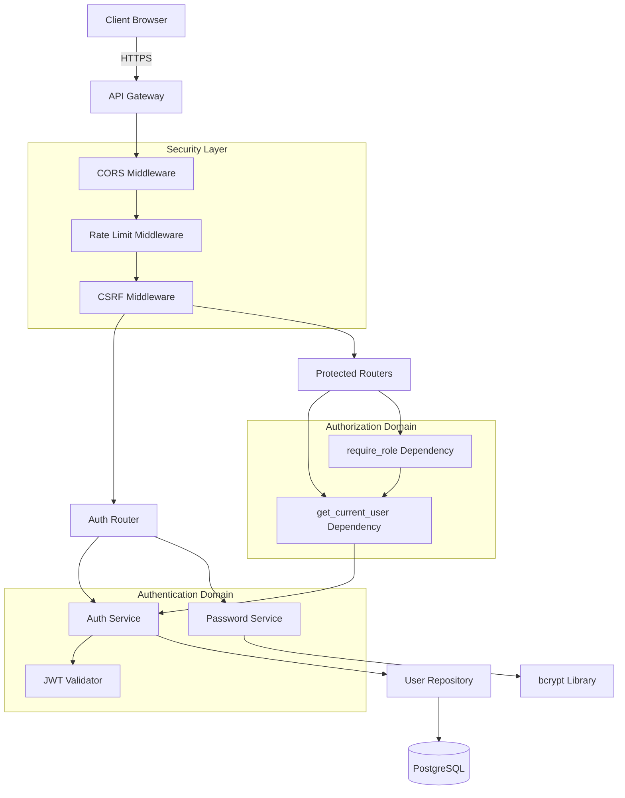
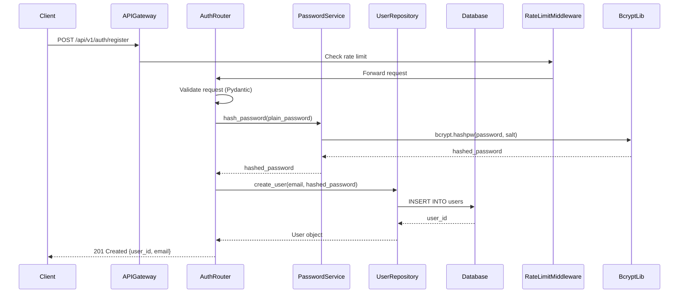
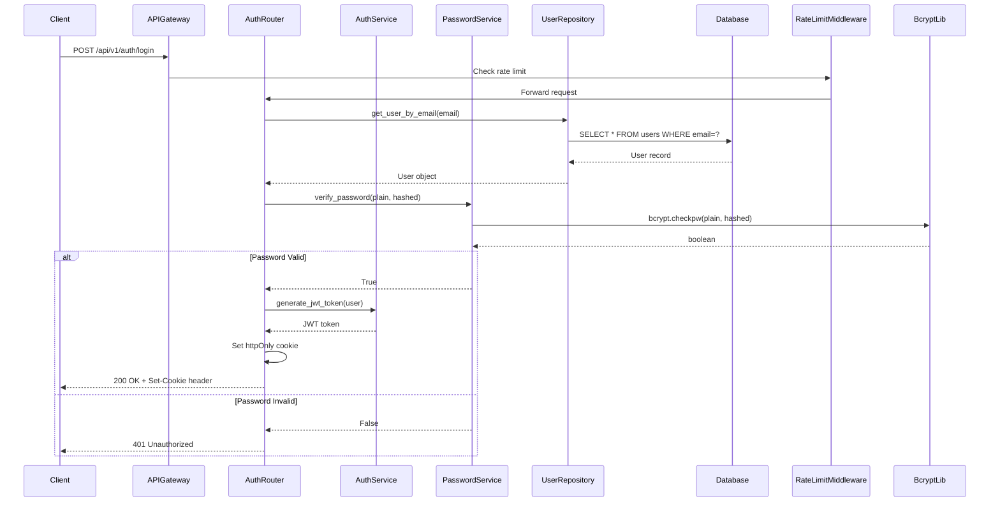
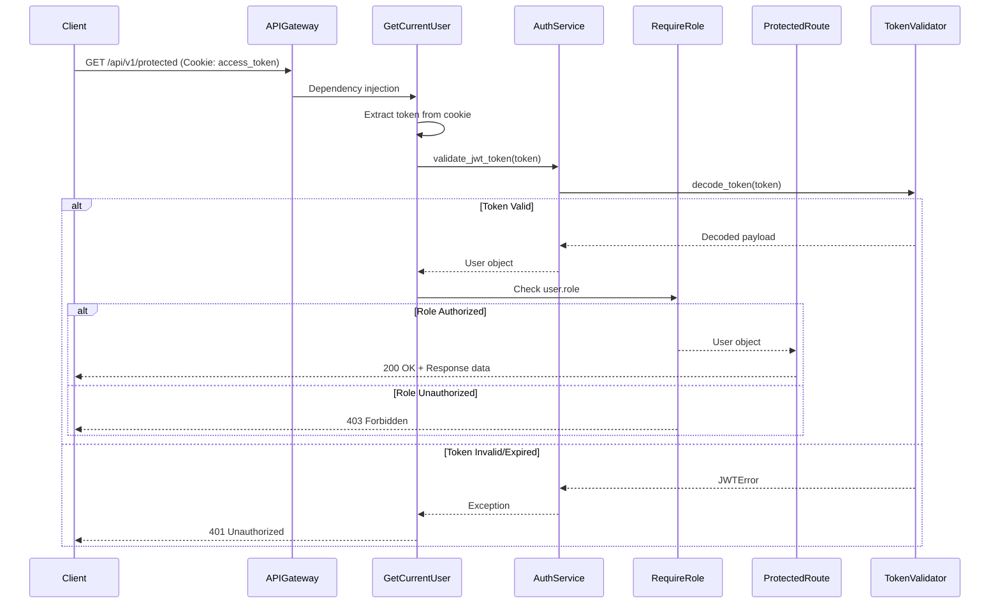

# Technical Design Document: Auth-Security-Foundation

## Overview

The Auth-Security-Foundation provides the core security infrastructure for The Sonic Immersive platform. This module implements JWT-based authentication, role-based access control (RBAC), password hashing with bcrypt, rate limiting, input validation, and comprehensive security measures including CORS, CSRF protection, and GDPR compliance.

**Purpose**: This feature delivers secure user authentication and authorization to all platform users, enabling role-based access to features while protecting against common security vulnerabilities (XSS, CSRF, SQL injection, brute force attacks).

**Users**: All users (guest, authenticated user, artist, admin) interact with this module during registration, login, and API access. Administrators manage security policies and audit logs.

**Impact**: Establishes foundational security layer that all other modules depend on. Changes authentication state management from stateless (no auth) to stateful (JWT-based sessions).

### Goals
- Implement secure JWT-based authentication with 24-hour token expiration
- Enforce role-based access control (guest, user, artist, admin)
- Protect against security vulnerabilities: XSS, CSRF, SQL injection, brute force
- Provide rate limiting (100 req/min unauthenticated, 1000 req/min authenticated)
- Ensure GDPR compliance for user data management

### Non-Goals
- OAuth2 social login (Google, Facebook) - deferred to future release
- Multi-factor authentication (MFA) - deferred to future release
- Token refresh mechanism - MVP uses single 24-hour token
- Session management across multiple devices - out of scope

## Architecture

### Architecture Pattern & Boundary Map

**Selected Pattern**: Middleware-based Authentication with Dependency Injection

**Architecture Integration**:
- **Pattern**: FastAPI middleware stack with dependency injection for route protection
- **Domain Boundaries**:
  - **Authentication**: User registration, login, token generation
  - **Authorization**: Role verification, permission checks
  - **Security**: Rate limiting, input validation, audit logging
- **Existing Patterns**: Follows FastAPI best practices (dependency injection, middleware, Pydantic validation)
- **New Components Rationale**:
  - **AuthService**: Encapsulates JWT generation/validation logic
  - **PasswordService**: Isolates bcrypt operations for testability
  - **RateLimitMiddleware**: Global rate limiting enforcement
  - **CSRFMiddleware**: CSRF protection for state-changing operations
- **Steering Compliance**: Aligns with Clean Architecture (Services → Repositories → Models), TDD methodology



### Technology Stack

| Layer | Choice / Version | Role in Feature | Notes |
|-------|------------------|-----------------|-------|
| Backend | FastAPI 0.100+ | API framework with OAuth2 support | Built-in OAuth2PasswordBearer, dependency injection |
| Authentication | python-jose 3.3+ | JWT token generation and validation | HS256 algorithm for symmetric key signing |
| Password Hashing | bcrypt 4.0+ | Password hashing with cost factor 12 | ~250ms hash time, industry standard |
| Rate Limiting | slowapi 0.1.9+ | Request rate limiting middleware | In-memory backend for MVP, Redis for production |
| Validation | Pydantic 2.0+ | Request/response validation and serialization | Automatic validation, custom validators |
| Data | PostgreSQL 14+ (Neon) | User data storage | See `.sdd/steering/structure.md` for schema |
| ORM | SQLAlchemy 2.0+ | Database access with async support | Parameterized queries prevent SQL injection |

## System Flows

### User Registration Flow



### User Login Flow



### Protected Route Access Flow



## Requirements Traceability

| Requirement | Summary | Components | Interfaces | Flows |
|-------------|---------|------------|------------|-------|
| 1.1, 1.2, 1.3 | User registration with validation | RegistrationService, PasswordService | POST /api/v1/auth/register | Registration Flow |
| 2.1, 2.2, 2.3 | User authentication with JWT | AuthService, PasswordService | POST /api/v1/auth/login | Login Flow |
| 3.1-3.8 | Role-based access control | AuthorizationService, require_role | get_current_user, require_role dependencies | Protected Route Flow |
| 4.1-4.7 | JWT token validation | AuthService, TokenValidator | get_current_user dependency | Protected Route Flow |
| 5.1-5.8 | Rate limiting | RateLimitMiddleware | Middleware (all routes) | All flows |
| 6.1-6.7 | Password security | PasswordService | hash_password, verify_password | Registration, Login |
| 7.1-7.7 | CORS configuration | CORSMiddleware | Middleware configuration | All flows |
| 8.1-8.7 | Input validation | Pydantic schemas | Request validation | All flows |
| 9.1-9.6 | SQL injection prevention | UserRepository (SQLAlchemy ORM) | ORM methods | Database queries |
| 10.1-10.6 | CSRF protection | CSRFMiddleware | Middleware (POST/PUT/DELETE) | State-changing operations |
| 11.1-11.7 | GDPR compliance | GDPRService | GET /api/v1/auth/export-data, DELETE /api/v1/auth/delete-account | Data export/deletion |
| 12.1-12.7 | Audit logging | LoggingService | Log all auth attempts | All auth operations |
| 13.1-13.6 | Account lockout | AccountLockoutService | Track failed attempts | Login Flow |
| 14.1-14.6 | Security headers | SecurityHeadersMiddleware | Middleware configuration | All flows |

## Components and Interfaces

### Component Summary

| Component | Domain/Layer | Intent | Req Coverage | Key Dependencies (P0/P1) | Contracts |
|-----------|--------------|--------|--------------|--------------------------|-----------|
| AuthService | Authentication/Service | JWT generation and validation | 2.1-2.3, 4.1-4.7 | python-jose (P0), UserRepository (P0) | Service |
| PasswordService | Authentication/Service | Password hashing and verification | 1.2, 2.1, 6.1-6.7 | bcrypt (P0) | Service |
| UserRepository | Data/Repository | User CRUD operations | All | SQLAlchemy (P0), Database (P0) | Service |
| RateLimitMiddleware | Security/Middleware | Request rate limiting | 5.1-5.8 | slowapi (P0) | Middleware |
| CORSMiddleware | Security/Middleware | CORS header management | 7.1-7.7 | FastAPI CORSMiddleware (P0) | Middleware |
| CSRFMiddleware | Security/Middleware | CSRF token validation | 10.1-10.6 | None | Middleware |
| get_current_user | Authorization/Dependency | Extract authenticated user | 3.1, 4.1-4.7 | AuthService (P0) | Dependency |
| require_role | Authorization/Dependency | Role-based access control | 3.2-3.8 | get_current_user (P0) | Dependency |
| GDPRService | Compliance/Service | Data export and deletion | 11.1-11.7 | UserRepository (P0) | Service, API |

### Authentication Domain

#### AuthService

| Field | Detail |
|-------|--------|
| Intent | Generate and validate JWT tokens for user authentication |
| Requirements | 2.1, 2.2, 2.3, 4.1-4.7 |

**Responsibilities & Constraints**
- Generate JWT tokens with 24-hour expiration
- Validate JWT tokens and extract user information
- Sign tokens using HS256 algorithm with JWT_SECRET
- Domain boundary: Authentication only (no authorization logic)
- Transaction scope: Stateless (no database writes)

**Dependencies**
- Inbound: AuthRouter — token generation on login (P0)
- Inbound: get_current_user — token validation on protected routes (P0)
- Outbound: python-jose library — JWT operations (P0)
- External: JWT_SECRET environment variable — token signing key (P0)

**Contracts**: Service [x]

##### Service Interface
```python
from typing import Optional
from datetime import datetime, timedelta
from jose import jwt, JWTError
from pydantic import BaseModel

class TokenPayload(BaseModel):
    sub: str  # user_id
    email: str
    role: str
    exp: datetime

class AuthService:
    def __init__(self, secret_key: str, algorithm: str = "HS256"):
        self.secret_key = secret_key
        self.algorithm = algorithm
        self.token_expiration_hours = 24
    
    def generate_token(self, user_id: str, email: str, role: str) -> str:
        """
        Generate JWT token with user information
        
        Preconditions:
        - user_id, email, role are non-empty strings
        - secret_key is configured
        
        Postconditions:
        - Returns valid JWT token string
        - Token expires in 24 hours
        
        Invariants:
        - Token includes exp claim for expiration
        - Token is signed with HS256 algorithm
        """
        pass
    
    def validate_token(self, token: str) -> Optional[TokenPayload]:
        """
        Validate JWT token and extract payload
        
        Preconditions:
        - token is non-empty string
        
        Postconditions:
        - Returns TokenPayload if valid
        - Returns None if invalid or expired
        
        Invariants:
        - Expired tokens always return None
        - Invalid signatures return None
        """
        pass
```

**Implementation Notes**
- Integration: Used by AuthRouter (login) and get_current_user dependency (protected routes)
- Validation: JWT expiration handled by python-jose library
- Risks: JWT_SECRET exposure allows token forgery (see research.md Risk 1)

#### PasswordService

| Field | Detail |
|-------|--------|
| Intent | Hash and verify passwords using bcrypt |
| Requirements | 1.2, 2.1, 6.1-6.7 |

**Responsibilities & Constraints**
- Hash passwords with bcrypt cost factor 12
- Verify passwords against stored hashes
- Domain boundary: Password operations only
- Transaction scope: Stateless (no database writes)

**Dependencies**
- Inbound: AuthRouter — hash passwords during registration (P0)
- Inbound: AuthRouter — verify passwords during login (P0)
- Outbound: bcrypt library — hashing operations (P0)

**Contracts**: Service [x]

##### Service Interface
```python
import bcrypt
from typing import str

class PasswordService:
    def __init__(self, cost_factor: int = 12):
        self.cost_factor = cost_factor
    
    def hash_password(self, plain_password: str) -> str:
        """
        Hash password using bcrypt
        
        Preconditions:
        - plain_password is non-empty string
        
        Postconditions:
        - Returns bcrypt hash string
        - Hash is salted and cost factor 12
        
        Invariants:
        - Same password produces different hashes (random salt)
        - Hash time approximately 250ms
        """
        pass
    
    def verify_password(self, plain_password: str, hashed_password: str) -> bool:
        """
        Verify password against hash
        
        Preconditions:
        - plain_password and hashed_password are non-empty strings
        
        Postconditions:
        - Returns True if password matches
        - Returns False if password does not match
        
        Invariants:
        - Verification time approximately 250ms
        - Timing-attack safe (constant time comparison)
        """
        pass
```

**Implementation Notes**
- Integration: Synchronous blocking calls (bcrypt is not async)
- Validation: Password strength validation happens at Pydantic schema level
- Risks: Performance impact on high-concurrency logins (see research.md Risk 2)

#### UserRepository

| Field | Detail |
|-------|--------|
| Intent | CRUD operations for user data with SQLAlchemy ORM |
| Requirements | All (data access layer) |

**Responsibilities & Constraints**
- Create, read, update user records
- Query users by email (unique constraint)
- Domain boundary: User entity only
- Transaction scope: Per-method (commit within method)

**Dependencies**
- Inbound: AuthService, GDPRService — user data access (P0)
- Outbound: SQLAlchemy ORM — database operations (P0)
- External: PostgreSQL database — data storage (P0)

**Contracts**: Service [x]

##### Service Interface
```python
from typing import Optional
from sqlalchemy.ext.asyncio import AsyncSession
from app.models import User

class UserRepository:
    def __init__(self, db: AsyncSession):
        self.db = db
    
    async def create_user(self, email: str, hashed_password: str, role: str = "user") -> User:
        """
        Create new user record
        
        Preconditions:
        - email is unique (not already in database)
        - hashed_password is bcrypt hash
        
        Postconditions:
        - User record inserted into database
        - Returns User object with generated user_id
        
        Invariants:
        - Email uniqueness enforced by database constraint
        - created_at and updated_at timestamps set
        """
        pass
    
    async def get_user_by_email(self, email: str) -> Optional[User]:
        """
        Retrieve user by email
        
        Preconditions:
        - email is non-empty string
        
        Postconditions:
        - Returns User if found
        - Returns None if not found
        
        Invariants:
        - Case-sensitive email match
        """
        pass
    
    async def get_user_by_id(self, user_id: str) -> Optional[User]:
        """
        Retrieve user by ID
        
        Preconditions:
        - user_id is valid UUID or integer
        
        Postconditions:
        - Returns User if found
        - Returns None if not found
        
        Invariants:
        - User ID is primary key
        """
        pass
```

**Implementation Notes**
- Integration: Async methods using SQLAlchemy 2.0 async support
- Validation: Database constraints enforce uniqueness
- Risks: SQL injection prevented by ORM parameterized queries

### Security Domain

#### RateLimitMiddleware

| Field | Detail |
|-------|--------|
| Intent | Enforce request rate limits per IP and per user |
| Requirements | 5.1-5.8 |

**Responsibilities & Constraints**
- Limit unauthenticated requests to 100/minute per IP
- Limit authenticated requests to 1000/minute per user
- Domain boundary: Global middleware (all routes)
- Transaction scope: Stateless (in-memory or Redis)

**Dependencies**
- Inbound: All API requests (P0)
- Outbound: slowapi library — rate limit logic (P0)
- External: Redis (optional, production only) — distributed rate limiting (P1)

**Contracts**: Middleware [x]

##### Middleware Configuration
```python
from slowapi import Limiter
from slowapi.util import get_remote_address
from fastapi import Request

def get_rate_limit_key(request: Request) -> str:
    """
    Determine rate limit key: IP for unauth, user_id for auth
    
    Preconditions:
    - request object is valid
    
    Postconditions:
    - Returns IP address if unauthenticated
    - Returns user_id if authenticated
    
    Invariants:
    - Authenticated users get higher limit (1000/min)
    - Unauthenticated users get lower limit (100/min)
    """
    if hasattr(request.state, "user"):
        return f"user:{request.state.user.id}"
    return get_remote_address(request)

limiter = Limiter(key_func=get_rate_limit_key)

# Apply to FastAPI app
@app.middleware("http")
async def rate_limit_middleware(request: Request, call_next):
    # slowapi handles rate limiting
    response = await call_next(request)
    return response
```

**Implementation Notes**
- Integration: Applied globally via FastAPI middleware
- Validation: Returns 429 status with Retry-After header
- Risks: IP-based limiting can be bypassed with VPN rotation (see research.md Risk 3)

#### CSRFMiddleware

| Field | Detail |
|-------|--------|
| Intent | Protect state-changing operations from CSRF attacks |
| Requirements | 10.1-10.6 |

**Responsibilities & Constraints**
- Generate CSRF tokens on first request
- Validate CSRF tokens on POST/PUT/PATCH/DELETE
- Domain boundary: State-changing operations only
- Transaction scope: Stateless (token in cookie and header)

**Dependencies**
- Inbound: All state-changing requests (P0)
- Outbound: None (built-in Python secrets module)

**Contracts**: Middleware [x]

##### Middleware Implementation
```python
import secrets
from fastapi import Request, HTTPException

class CSRFMiddleware:
    def __init__(self, app):
        self.app = app
    
    async def __call__(self, scope, receive, send):
        request = Request(scope, receive)
        
        # Generate CSRF token if not present
        if "csrf_token" not in request.cookies:
            csrf_token = secrets.token_urlsafe(32)
            response.set_cookie("csrf_token", csrf_token, httponly=False, samesite="strict")
        
        # Validate CSRF token on state-changing methods
        if request.method in ["POST", "PUT", "PATCH", "DELETE"]:
            cookie_token = request.cookies.get("csrf_token")
            header_token = request.headers.get("X-CSRF-Token")
            
            if cookie_token != header_token:
                raise HTTPException(status_code=403, detail="CSRF token validation failed")
        
        return await self.app(scope, receive, send)
```

**Implementation Notes**
- Integration: Applied globally via FastAPI middleware
- Validation: Frontend reads cookie and includes in X-CSRF-Token header
- Risks: Implementation complexity (see research.md Risk 4)

### Authorization Domain

#### get_current_user Dependency

| Field | Detail |
|-------|--------|
| Intent | Extract authenticated user from JWT token |
| Requirements | 3.1, 4.1-4.7 |

**Responsibilities & Constraints**
- Extract JWT from httpOnly cookie
- Validate token and return User object
- Domain boundary: Authentication extraction only
- Transaction scope: Stateless (token validation)

**Dependencies**
- Inbound: All protected routes (P0)
- Outbound: AuthService — token validation (P0)
- Outbound: UserRepository — user retrieval (P0)

**Contracts**: Dependency [x]

##### Dependency Implementation
```python
from fastapi import Depends, HTTPException, status, Request
from typing import Optional

async def get_current_user(request: Request, auth_service: AuthService = Depends(), user_repo: UserRepository = Depends()) -> User:
    """
    Extract and validate current user from JWT token
    
    Preconditions:
    - Request contains access_token cookie
    
    Postconditions:
    - Returns User object if token valid
    - Raises 401 if token invalid/expired
    
    Invariants:
    - Always validates token expiration
    - Always returns fresh User from database
    """
    token = request.cookies.get("access_token")
    if not token:
        raise HTTPException(status_code=401, detail="Authentication required")
    
    payload = auth_service.validate_token(token)
    if not payload:
        raise HTTPException(status_code=401, detail="Invalid or expired token")
    
    user = await user_repo.get_user_by_id(payload.sub)
    if not user:
        raise HTTPException(status_code=401, detail="User not found")
    
    return user
```

**Implementation Notes**
- Integration: Used as dependency in protected route decorators
- Validation: Token expiration handled by AuthService
- Risks: Database query on every request (acceptable for MVP, consider caching for production)

#### require_role Dependency

| Field | Detail |
|-------|--------|
| Intent | Enforce role-based access control on routes |
| Requirements | 3.2-3.8 |

**Responsibilities & Constraints**
- Verify user has required role(s)
- Return user if authorized, raise 403 if not
- Domain boundary: Authorization only
- Transaction scope: Stateless (no database writes)

**Dependencies**
- Inbound: Protected routes requiring specific roles (P0)
- Outbound: get_current_user — user extraction (P0)

**Contracts**: Dependency [x]

##### Dependency Implementation
```python
from enum import Enum

class UserRole(str, Enum):
    GUEST = "guest"
    USER = "user"
    ARTIST = "artist"
    ADMIN = "admin"

def require_role(*allowed_roles: UserRole):
    async def role_checker(current_user: User = Depends(get_current_user)) -> User:
        """
        Verify user has required role
        
        Preconditions:
        - current_user is authenticated
        
        Postconditions:
        - Returns user if role authorized
        - Raises 403 if role not authorized
        
        Invariants:
        - Role check happens after authentication
        - Multiple allowed roles use OR logic
        """
        if current_user.role not in allowed_roles:
            raise HTTPException(status_code=403, detail="Insufficient permissions")
        return current_user
    return role_checker
```

**Implementation Notes**
- Integration: Used as dependency in route decorators: `current_user: User = Depends(require_role(UserRole.ADMIN))`
- Validation: Enum ensures type safety for roles
- Risks: None (simple role check)

## Data Models

### Domain Model

**User Aggregate**
- **Entity**: User (aggregate root)
- **Value Objects**: UserRole (enum)
- **Domain Events**: UserRegistered, UserLoggedIn, UserLoggedOut
- **Business Rules**:
  - Email must be unique
  - Password must meet strength requirements
  - Role transitions: guest → user (on registration), user → artist (admin action), user → admin (admin action)
- **Invariants**:
  - User always has exactly one role
  - Email cannot be changed (immutable after registration)
  - Password hash never exposed in API responses

### Logical Data Model

**Structure Definition**:

**Users Table**
- `id` (Primary Key): UUID or SERIAL
- `email` (Unique): VARCHAR(255), NOT NULL
- `password_hash`: VARCHAR(255), NOT NULL
- `role`: ENUM('guest', 'user', 'artist', 'admin'), NOT NULL, DEFAULT 'user'
- `failed_login_attempts`: INTEGER, DEFAULT 0
- `account_locked_until`: TIMESTAMPTZ, NULL
- `created_at`: TIMESTAMPTZ, DEFAULT NOW()
- `updated_at`: TIMESTAMPTZ, DEFAULT NOW()

**Indexes**:
- PRIMARY KEY on `id`
- UNIQUE INDEX on `email`
- INDEX on `account_locked_until` (for lockout queries)

**Consistency & Integrity**:
- Transaction boundary: Single user aggregate
- Cascading rules: None (users are leaf entities for auth module)
- Temporal aspects: `created_at` immutable, `updated_at` updated on every modification

### Physical Data Model

**PostgreSQL Implementation**:

```sql
-- Users table (authentication)
CREATE TABLE users (
    id SERIAL PRIMARY KEY,
    email VARCHAR(255) UNIQUE NOT NULL,
    password_hash VARCHAR(255) NOT NULL,
    role VARCHAR(20) NOT NULL DEFAULT 'user',
    failed_login_attempts INTEGER DEFAULT 0,
    account_locked_until TIMESTAMPTZ,
    created_at TIMESTAMPTZ DEFAULT NOW(),
    updated_at TIMESTAMPTZ DEFAULT NOW()
);

-- Indexes for performance
CREATE UNIQUE INDEX idx_users_email ON users(email);
CREATE INDEX idx_users_locked ON users(account_locked_until) WHERE account_locked_until IS NOT NULL;

-- Trigger for updated_at
CREATE OR REPLACE FUNCTION update_updated_at_column()
RETURNS TRIGGER AS $$
BEGIN
    NEW.updated_at = NOW();
    RETURN NEW;
END;
$$ language 'plpgsql';

CREATE TRIGGER update_users_updated_at BEFORE UPDATE ON users
FOR EACH ROW EXECUTE FUNCTION update_updated_at_column();
```

**Audit Logging Table**:

```sql
-- Authentication audit log
CREATE TABLE auth_audit_log (
    id SERIAL PRIMARY KEY,
    user_id INTEGER REFERENCES users(id) ON DELETE SET NULL,
    email VARCHAR(255) NOT NULL,
    event_type VARCHAR(50) NOT NULL,  -- 'login_success', 'login_failure', 'logout', 'register'
    ip_address INET,
    user_agent TEXT,
    created_at TIMESTAMPTZ DEFAULT NOW()
);

-- Index for queries by user and time
CREATE INDEX idx_auth_audit_user_time ON auth_audit_log(user_id, created_at DESC);
CREATE INDEX idx_auth_audit_email_time ON auth_audit_log(email, created_at DESC);
```

### Data Contracts & Integration

**API Data Transfer**

**Registration Request**:
```python
class RegisterRequest(BaseModel):
    email: EmailStr
    password: str
    
    @validator('password')
    def validate_password_strength(cls, v):
        if len(v) < 8:
            raise ValueError('Password must be at least 8 characters')
        if not re.search(r'[A-Z]', v):
            raise ValueError('Password must contain uppercase letter')
        if not re.search(r'[a-z]', v):
            raise ValueError('Password must contain lowercase letter')
        if not re.search(r'\d', v):
            raise ValueError('Password must contain digit')
        if not re.search(r'[!@#$%^&*]', v):
            raise ValueError('Password must contain special character')
        return v
```

**Login Request**:
```python
class LoginRequest(BaseModel):
    email: EmailStr
    password: str
```

**User Response** (never includes password_hash):
```python
class UserResponse(BaseModel):
    id: int
    email: str
    role: UserRole
    created_at: datetime
    
    class Config:
        from_attributes = True  # Enable SQLAlchemy model conversion
```

## Error Handling

### Error Strategy

**User Errors (4xx)**:
- `400 Bad Request`: Invalid input (validation failures)
- `401 Unauthorized`: Missing or invalid JWT token
- `403 Forbidden`: Insufficient permissions (role check failed)
- `409 Conflict`: Email already registered
- `429 Too Many Requests`: Rate limit exceeded

**System Errors (5xx)**:
- `500 Internal Server Error`: Unexpected exceptions (logged with correlation ID)
- `503 Service Unavailable`: Database connection failure

**Business Logic Errors (422)**:
- Account locked due to failed login attempts
- Password does not meet strength requirements

### Error Categories and Responses

**Authentication Errors**:
- Invalid credentials → 401 with generic message "Invalid credentials" (no username/password distinction)
- Token expired → 401 with message "Token expired"
- Account locked → 429 with message "Account temporarily locked" + Retry-After header

**Authorization Errors**:
- Insufficient permissions → 403 with message "Insufficient permissions"
- Role mismatch → 403 with required role information

**Validation Errors**:
- Pydantic validation failure → 400 with field-level error details
- Password strength failure → 400 with specific requirement messages

### Monitoring

**Error Tracking**:
- All 5xx errors logged with stack traces and correlation IDs
- Failed login attempts logged to auth_audit_log table
- Rate limit violations logged with IP and user_id

**Health Monitoring**:
- `/health` endpoint: Returns 200 if app is running
- `/ready` endpoint: Returns 200 if database connection is healthy

**Metrics**:
- Login success rate (target: >95%)
- Failed login attempts per user (alert if >5 in 15 minutes)
- JWT validation latency (target: <50ms p95)
- Rate limit hit rate (monitor for attack patterns)

## Testing Strategy

### Unit Tests
- `test_auth_service_generate_token`: Verify JWT token generation with correct payload
- `test_auth_service_validate_token_expired`: Verify expired tokens are rejected
- `test_password_service_hash_password`: Verify bcrypt hashing with cost factor 12
- `test_password_service_verify_password`: Verify password verification succeeds for correct password
- `test_require_role_dependency`: Verify role checker allows/denies based on user role

### Integration Tests
- `test_register_user_api`: POST /api/v1/auth/register with valid data returns 201
- `test_register_duplicate_email`: POST /api/v1/auth/register with existing email returns 409
- `test_login_success`: POST /api/v1/auth/login with valid credentials returns JWT cookie
- `test_login_invalid_credentials`: POST /api/v1/auth/login with wrong password returns 401
- `test_protected_route_requires_auth`: GET protected endpoint without token returns 401
- `test_protected_route_requires_role`: GET admin endpoint with user role returns 403
- `test_rate_limit_enforcement`: Exceed rate limit returns 429 with Retry-After header
- `test_csrf_protection`: POST without CSRF token returns 403

### E2E/UI Tests
- `test_user_registration_flow`: Complete registration from UI to success message
- `test_user_login_logout_flow`: Login, access protected page, logout
- `test_account_lockout_flow`: 5 failed logins locks account for 30 minutes
- `test_admin_access_control`: Admin can access admin panel, regular user cannot

### Performance Tests
- `test_bcrypt_hashing_performance`: Hash 100 passwords in <30 seconds (300ms each)
- `test_jwt_validation_performance`: Validate 1000 tokens in <5 seconds (5ms each)
- `test_concurrent_login_load`: 100 concurrent logins complete without errors

## Security Considerations

### Threat Modeling
- **XSS Protection**: httpOnly cookies prevent JavaScript access to JWT
- **CSRF Protection**: Double-submit cookie pattern validates state-changing requests
- **SQL Injection**: SQLAlchemy ORM uses parameterized queries
- **Brute Force**: Rate limiting + account lockout mitigate brute force attacks
- **Token Forgery**: JWT signed with secret key, signature validation prevents forgery

### Authentication and Authorization
- **JWT Storage**: httpOnly, secure, SameSite=Strict cookies
- **Password Hashing**: bcrypt cost factor 12 (industry standard)
- **Role-Based Access**: Enum-based roles enforced via dependency injection

### Data Protection
- **Passwords**: Never logged, never exposed in API responses
- **JWT Secret**: Stored in environment variable, rotated every 90 days
- **Audit Logs**: Retain 90 days, anonymize after GDPR data deletion

### Compliance
- **GDPR**: Data export and deletion endpoints (Requirement 11)
- **OWASP Top 10**: Mitigations for all applicable vulnerabilities
- **Security Headers**: Implemented via SecurityHeadersMiddleware (Requirement 14)

## Performance & Scalability

### Target Metrics
- Login API: <500ms response time (p95)
- JWT validation: <50ms (p95)
- Password hashing: ~250ms (acceptable for login)
- Rate limiting check: <10ms

### Scaling Approaches
- **Horizontal Scaling**: Stateless services (JWT in cookies)
- **Rate Limiting**: Redis backend for distributed rate limiting
- **Database**: Connection pooling (10-20 connections)

### Caching Strategies
- **No caching for MVP**: JWT validation queries database on every request
- **Future**: Cache user data in Redis with 5-minute TTL

## Migration Strategy

Not applicable (greenfield implementation).

**Deployment Steps**:
1. Create database schema (users, auth_audit_log tables)
2. Set environment variables (JWT_SECRET, DATABASE_URL, FRONTEND_URL)
3. Run database migrations
4. Deploy backend with middleware configuration
5. Verify /health and /ready endpoints
6. Test registration and login flows
7. Monitor error logs and metrics
