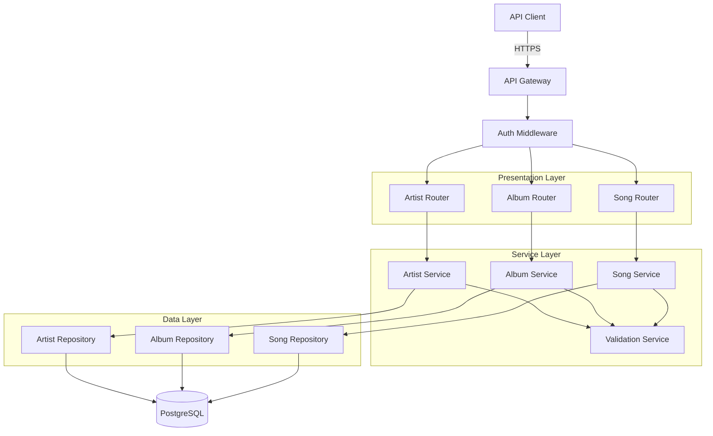
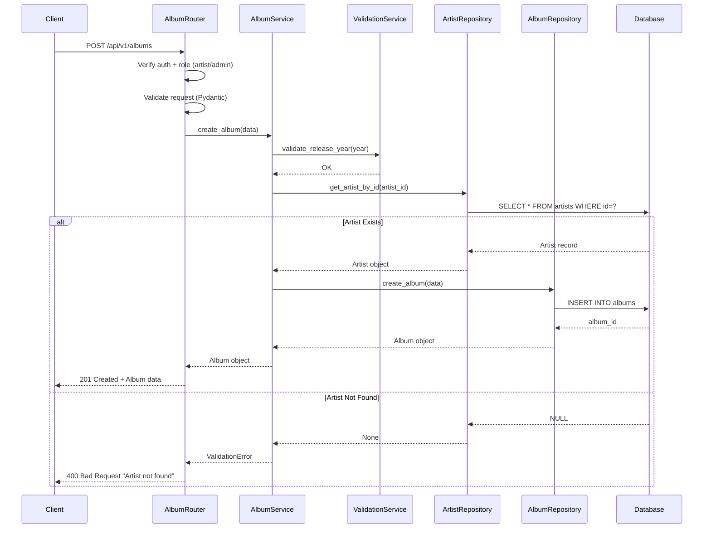
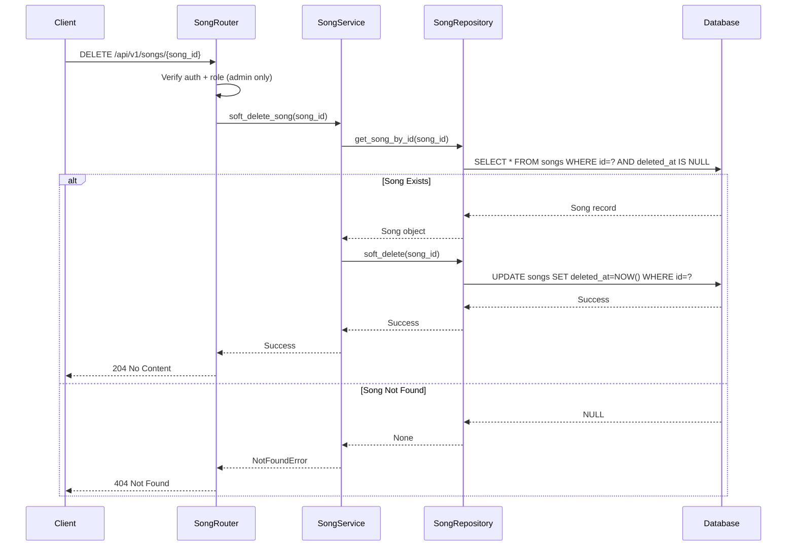
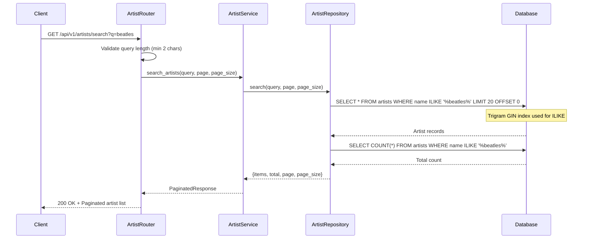

# Technical Design Document: Music-Catalog-Management

## Overview

The Music-Catalog-Management module provides comprehensive CRUD operations for the core catalog entities: Artists, Albums, and Songs. This system manages hierarchical relationships (artist → albums → songs), enforces validation rules, implements soft delete for songs, and provides pagination and search capabilities.

**Purpose**: This feature delivers music catalog management to admin and artist users, enabling them to maintain accurate catalog data while supporting discovery features for all users.

**Users**: 
- **Admin/Artist roles**: Create, update, delete catalog entries
- **All users**: Browse, search, and retrieve catalog data

**Impact**: Establishes core data model that all other modules (playlists, reviews, search) depend on. Defines hierarchical catalog structure and relationships.

### Goals
- Implement CRUD operations for Artists, Albums, Songs with validation
- Enforce hierarchical relationships (artist → albums → songs)
- Support soft delete pattern for songs (audit trail)
- Provide pagination (20 items/page, max 100) and search capabilities
- Meet performance targets (<300ms for queries up to 100k records)

### Non-Goals
- Audio file storage/streaming (deferred to future release)
- Genre taxonomy management (simple string field for MVP)
- Bulk import operations (single-record operations only)
- Advanced search (fuzzy matching, filters) - basic partial match only

## Architecture

### Architecture Pattern & Boundary Map

**Selected Pattern**: Clean Architecture with Repository Pattern

**Architecture Integration**:
- **Pattern**: Routes → Services → Repositories → Models (Clean Architecture)
- **Domain Boundaries**:
  - **Artist Domain**: Artist entity, country validation
  - **Album Domain**: Album entity, artist relationship, release year validation
  - **Song Domain**: Song entity, album relationship, soft delete, duration validation
- **Existing Patterns**: Follows steering Clean Architecture and SQLAlchemy ORM patterns
- **New Components Rationale**:
  - **ArtistRepository/Service**: Artist CRUD and search
  - **AlbumRepository/Service**: Album CRUD with artist relationship
  - **SongRepository/Service**: Song CRUD with soft delete
  - **ValidationService**: Shared validation logic (country codes, URLs)
- **Steering Compliance**: Aligns with `.sdd/steering/structure.md` database schema and Clean Architecture principles



### Technology Stack

| Layer | Choice / Version | Role in Feature | Notes |
|-------|------------------|-----------------|-------|
| Backend | FastAPI 0.100+ | API framework | Async routes, Pydantic validation |
| ORM | SQLAlchemy 2.0+ | Database access | AsyncSession, relationship loading |
| Database | PostgreSQL 14+ (Neon) | Data storage | Artists, albums, songs tables |
| Validation | Pydantic 2.0+ | Request/response validation | Custom validators for country, year, duration |
| Country Codes | pycountry 22.3+ | ISO 3166-1 alpha-2 validation | Country code lookup |
| Connection Pool | AsyncEngine (SQLAlchemy) | Database connections | Pool size: 10-20 connections |

## System Flows

### Create Album Flow (with Artist Relationship)



### Song Soft Delete Flow



### Artist Search Flow



## Requirements Traceability

| Requirement | Summary | Components | Interfaces | Flows |
|-------------|---------|------------|------------|-------|
| 1.1-1.8 | Artist creation with validation | ArtistService, ArtistRepository, ValidationService | POST /api/v1/artists | - |
| 2.1-2.8 | Artist retrieval and pagination | ArtistService, ArtistRepository | GET /api/v1/artists, GET /api/v1/artists/{id} | - |
| 3.1-3.6 | Artist search | ArtistService, ArtistRepository | GET /api/v1/artists/search | Search Flow |
| 4.1-4.7 | Artist update | ArtistService, ArtistRepository | PUT /api/v1/artists/{id} | - |
| 5.1-5.9 | Album creation | AlbumService, AlbumRepository, ArtistRepository | POST /api/v1/albums | Create Album Flow |
| 6.1-6.7 | Album retrieval | AlbumService, AlbumRepository | GET /api/v1/albums, GET /api/v1/albums/{id} | - |
| 7.1-7.6 | Album update | AlbumService, AlbumRepository | PUT /api/v1/albums/{id} | - |
| 8.1-8.9 | Song creation | SongService, SongRepository, AlbumRepository | POST /api/v1/songs | - |
| 9.1-9.7 | Song retrieval | SongService, SongRepository | GET /api/v1/songs, GET /api/v1/songs/{id} | - |
| 10.1-10.5 | Song update | SongService, SongRepository | PUT /api/v1/songs/{id} | - |
| 11.1-11.7 | Song soft delete | SongService, SongRepository | DELETE /api/v1/songs/{id} | Soft Delete Flow |
| 12.1-12.6 | Referential integrity | Database constraints (foreign keys) | Database schema | - |
| 13.1-13.5 | Search performance | ArtistRepository, AlbumRepository, SongRepository, Database indexes | All search endpoints | Search Flow |
| 14.1-14.7 | Data validation | ValidationService, Pydantic schemas | All endpoints | - |

## Components and Interfaces

### Component Summary

| Component | Domain/Layer | Intent | Req Coverage | Key Dependencies (P0/P1) | Contracts |
|-----------|--------------|--------|--------------|--------------------------|-----------|
| ArtistService | Service | Artist business logic | 1.1-4.7 | ArtistRepository (P0), ValidationService (P0) | Service |
| AlbumService | Service | Album business logic | 5.1-7.6 | AlbumRepository (P0), ArtistRepository (P0), ValidationService (P0) | Service |
| SongService | Service | Song business logic | 8.1-11.7 | SongRepository (P0), AlbumRepository (P0), ValidationService (P0) | Service |
| ValidationService | Service | Shared validation logic | 14.1-14.7 | pycountry (P0) | Service |
| ArtistRepository | Data | Artist CRUD operations | 1.1-4.7 | SQLAlchemy AsyncSession (P0) | Service |
| AlbumRepository | Data | Album CRUD operations | 5.1-7.6 | SQLAlchemy AsyncSession (P0) | Service |
| SongRepository | Data | Song CRUD with soft delete | 8.1-11.7 | SQLAlchemy AsyncSession (P0) | Service |

### Service Layer

#### ArtistService

| Field | Detail |
|-------|--------|
| Intent | Coordinate artist CRUD operations with validation |
| Requirements | 1.1-4.7 |

**Responsibilities & Constraints**
- Validate artist data before persistence
- Coordinate with ValidationService for country codes
- Domain boundary: Artist aggregate only
- Transaction scope: Single artist per operation

**Dependencies**
- Inbound: ArtistRouter — API request handling (P0)
- Outbound: ArtistRepository — data persistence (P0)
- Outbound: ValidationService — country code validation (P0)

**Contracts**: Service [x]

##### Service Interface
```python
from typing import Optional, List
from pydantic import BaseModel

class ArtistCreateRequest(BaseModel):
    name: str  # 1-200 characters
    country: str  # ISO 3166-1 alpha-2

class ArtistUpdateRequest(BaseModel):
    name: Optional[str] = None
    country: Optional[str] = None

class ArtistResponse(BaseModel):
    id: int
    name: str
    country: str
    albums_count: int
    created_at: datetime
    updated_at: datetime

class PaginatedArtistResponse(BaseModel):
    items: List[ArtistResponse]
    total: int
    page: int
    page_size: int
    total_pages: int

class ArtistService:
    def __init__(self, artist_repo: ArtistRepository, validation_service: ValidationService):
        self.artist_repo = artist_repo
        self.validation_service = validation_service
    
    async def create_artist(self, data: ArtistCreateRequest) -> ArtistResponse:
        """
        Create new artist with validation
        
        Preconditions:
        - name is 1-200 characters
        - country is valid ISO 3166-1 alpha-2 code
        
        Postconditions:
        - Artist record created in database
        - Returns artist with generated ID
        
        Invariants:
        - created_at and updated_at timestamps set
        """
        pass
    
    async def get_artist_by_id(self, artist_id: int) -> Optional[ArtistResponse]:
        """
        Retrieve artist by ID with albums count
        
        Preconditions:
        - artist_id is positive integer
        
        Postconditions:
        - Returns artist if found
        - Returns None if not found
        - Includes albums_count field
        
        Invariants:
        - albums_count calculated from albums table
        """
        pass
    
    async def search_artists(self, query: str, page: int = 1, page_size: int = 20) -> PaginatedArtistResponse:
        """
        Search artists by name with pagination
        
        Preconditions:
        - query is at least 2 characters
        - page >= 1
        - page_size <= 100
        
        Postconditions:
        - Returns paginated results
        - Case-insensitive partial match
        - Results within 200ms (Requirement 3.11)
        
        Invariants:
        - Results ordered by relevance (exact match first)
        """
        pass
    
    async def update_artist(self, artist_id: int, data: ArtistUpdateRequest) -> Optional[ArtistResponse]:
        """
        Update artist record
        
        Preconditions:
        - artist_id exists
        - Partial update (only provided fields updated)
        
        Postconditions:
        - Artist record updated
        - updated_at timestamp refreshed
        - created_at unchanged
        
        Invariants:
        - Validation rules applied to updated fields
        """
        pass
```

**Implementation Notes**
- Integration: Called by ArtistRouter with auth/role verification
- Validation: Country codes validated by ValidationService before DB call
- Risks: N+1 queries for albums_count (use subquery or aggregate)

#### AlbumService

| Field | Detail |
|-------|--------|
| Intent | Coordinate album CRUD operations with artist relationship validation |
| Requirements | 5.1-7.6 |

**Responsibilities & Constraints**
- Validate album data and artist existence
- Calculate total duration from songs
- Domain boundary: Album aggregate with artist relationship
- Transaction scope: Single album per operation

**Dependencies**
- Inbound: AlbumRouter — API request handling (P0)
- Outbound: AlbumRepository — data persistence (P0)
- Outbound: ArtistRepository — artist validation (P0)
- Outbound: ValidationService — release year, URL validation (P0)

**Contracts**: Service [x]

##### Service Interface
```python
class AlbumCreateRequest(BaseModel):
    title: str  # 1-200 characters
    artist_id: int
    release_year: int  # 1900 to current_year + 1
    album_cover_url: Optional[str] = None

class AlbumResponse(BaseModel):
    id: int
    title: str
    artist_id: int
    artist_name: str
    release_year: int
    album_cover_url: Optional[str]
    songs_count: int
    total_duration_seconds: int
    created_at: datetime
    updated_at: datetime

class AlbumService:
    def __init__(self, album_repo: AlbumRepository, artist_repo: ArtistRepository, validation_service: ValidationService):
        self.album_repo = album_repo
        self.artist_repo = artist_repo
        self.validation_service = validation_service
    
    async def create_album(self, data: AlbumCreateRequest) -> AlbumResponse:
        """
        Create album with artist relationship validation
        
        Preconditions:
        - artist_id exists in database
        - release_year between 1900 and current_year + 1
        - album_cover_url is valid http/https URL (if provided)
        
        Postconditions:
        - Album record created
        - Returns album with artist name
        
        Invariants:
        - Foreign key constraint enforced
        - Raises 400 if artist not found
        """
        pass
    
    async def get_album_by_id(self, album_id: int) -> Optional[AlbumResponse]:
        """
        Retrieve album with song count and total duration
        
        Preconditions:
        - album_id is positive integer
        
        Postconditions:
        - Returns album if found
        - Includes songs_count and total_duration_seconds
        - Includes artist_name (joined)
        
        Invariants:
        - total_duration_seconds = SUM(song.duration_seconds)
        """
        pass
    
    async def list_albums(self, artist_id: Optional[int] = None, page: int = 1, page_size: int = 20) -> PaginatedAlbumResponse:
        """
        List albums with optional artist filter
        
        Preconditions:
        - page >= 1, page_size <= 100
        
        Postconditions:
        - Returns paginated results
        - Ordered by release_year DESC, title ASC (Requirement 6.2)
        - Filtered by artist_id if provided
        
        Invariants:
        - Default page_size: 20, max: 100
        """
        pass
```

**Implementation Notes**
- Integration: Validates artist existence before album creation
- Validation: Release year validated by ValidationService
- Risks: total_duration_seconds requires aggregation (use SQL SUM)

#### SongService

| Field | Detail |
|-------|--------|
| Intent | Coordinate song CRUD operations with soft delete support |
| Requirements | 8.1-11.7 |

**Responsibilities & Constraints**
- Validate song data and album existence
- Implement soft delete pattern
- Filter deleted songs from queries
- Domain boundary: Song aggregate with album relationship
- Transaction scope: Single song per operation

**Dependencies**
- Inbound: SongRouter — API request handling (P0)
- Outbound: SongRepository — data persistence with soft delete (P0)
- Outbound: AlbumRepository — album validation (P0)
- Outbound: ValidationService — duration validation (P0)

**Contracts**: Service [x]

##### Service Interface
```python
class SongCreateRequest(BaseModel):
    title: str  # 1-200 characters
    album_id: int
    duration_seconds: int  # 1-7200 (2 hours max)
    genre: Optional[str] = None
    year: Optional[int] = None
    external_links: Optional[dict] = None

class SongResponse(BaseModel):
    id: int
    title: str
    album_id: int
    album_title: str
    artist_id: int
    artist_name: str
    duration_seconds: int
    genre: Optional[str]
    year: Optional[int]
    external_links: Optional[dict]
    created_at: datetime
    updated_at: datetime

class SongService:
    def __init__(self, song_repo: SongRepository, album_repo: AlbumRepository, validation_service: ValidationService):
        self.song_repo = song_repo
        self.album_repo = album_repo
        self.validation_service = validation_service
    
    async def create_song(self, data: SongCreateRequest) -> SongResponse:
        """
        Create song with album relationship validation
        
        Preconditions:
        - album_id exists in database
        - duration_seconds between 1 and 7200
        
        Postconditions:
        - Song record created
        - Returns song with album/artist names (joined)
        
        Invariants:
        - Foreign key constraint enforced
        - Raises 400 if album not found
        """
        pass
    
    async def get_song_by_id(self, song_id: int, include_deleted: bool = False) -> Optional[SongResponse]:
        """
        Retrieve song by ID
        
        Preconditions:
        - song_id is positive integer
        
        Postconditions:
        - Returns song if found and not deleted
        - Returns None if deleted (unless include_deleted=True)
        - Includes album/artist names (joined)
        
        Invariants:
        - Soft-deleted songs excluded by default
        """
        pass
    
    async def soft_delete_song(self, song_id: int) -> None:
        """
        Soft delete song (set deleted_at timestamp)
        
        Preconditions:
        - song_id exists and not already deleted
        
        Postconditions:
        - deleted_at timestamp set to NOW()
        - Song excluded from future queries
        
        Invariants:
        - Record remains in database
        - Can be restored by setting deleted_at = NULL
        """
        pass
    
    async def restore_song(self, song_id: int) -> Optional[SongResponse]:
        """
        Restore soft-deleted song
        
        Preconditions:
        - song_id exists and is deleted
        
        Postconditions:
        - deleted_at set to NULL
        - Song appears in queries again
        
        Invariants:
        - Admin-only operation
        """
        pass
```

**Implementation Notes**
- Integration: Repository enforces deleted_at filter automatically
- Validation: Duration validated by ValidationService (1-7200 seconds)
- Risks: Forgetting deleted_at filter (mitigated by repository base method)

#### ValidationService

| Field | Detail |
|-------|--------|
| Intent | Centralize validation logic for catalog entities |
| Requirements | 14.1-14.7 |

**Responsibilities & Constraints**
- Validate country codes (ISO 3166-1 alpha-2)
- Validate release years (1900 to current_year + 1)
- Validate durations (1-7200 seconds)
- Validate URLs (http/https schemes)
- Domain boundary: Validation logic only (no persistence)
- Transaction scope: Stateless

**Dependencies**
- Inbound: ArtistService, AlbumService, SongService — validation requests (P0)
- Outbound: pycountry library — country code lookup (P0)

**Contracts**: Service [x]

##### Service Interface
```python
import pycountry
import re
from datetime import datetime

class ValidationService:
    def validate_country_code(self, code: str) -> bool:
        """
        Validate ISO 3166-1 alpha-2 country code
        
        Preconditions:
        - code is 2-character string
        
        Postconditions:
        - Returns True if valid country code
        - Returns False if invalid
        
        Invariants:
        - Uses pycountry official ISO data
        """
        country = pycountry.countries.get(alpha_2=code.upper())
        return country is not None
    
    def validate_release_year(self, year: int) -> bool:
        """
        Validate release year range
        
        Preconditions:
        - year is integer
        
        Postconditions:
        - Returns True if 1900 <= year <= current_year + 1
        - Returns False otherwise
        
        Invariants:
        - Allows pre-release albums (current_year + 1)
        """
        current_year = datetime.now().year
        return 1900 <= year <= current_year + 1
    
    def validate_duration_seconds(self, duration: int) -> bool:
        """
        Validate song duration
        
        Preconditions:
        - duration is positive integer
        
        Postconditions:
        - Returns True if 1 <= duration <= 7200
        - Returns False otherwise
        
        Invariants:
        - Max duration: 2 hours (7200 seconds)
        """
        return 1 <= duration <= 7200
    
    def validate_url(self, url: str) -> bool:
        """
        Validate URL format (http/https only)
        
        Preconditions:
        - url is non-empty string
        
        Postconditions:
        - Returns True if valid http/https URL
        - Returns False otherwise
        
        Invariants:
        - Regex validation only (no reachability check)
        """
        pattern = r'^https?://.*\.(jpg|jpeg|png|gif|webp)$'
        return re.match(pattern, url, re.IGNORECASE) is not None
```

**Implementation Notes**
- Integration: Called by services before persistence
- Validation: Pydantic validators delegate to this service
- Risks: pycountry version changes (pin version in requirements.txt)

### Data Layer

#### Repository Base Methods

All repositories inherit from base repository with common patterns:

```python
from sqlalchemy.ext.asyncio import AsyncSession
from sqlalchemy import select, func
from typing import Generic, TypeVar, Optional, List

T = TypeVar('T')

class BaseRepository(Generic[T]):
    def __init__(self, db: AsyncSession, model: type[T]):
        self.db = db
        self.model = model
    
    async def create(self, **data) -> T:
        """Create new record"""
        instance = self.model(**data)
        self.db.add(instance)
        await self.db.commit()
        await self.db.refresh(instance)
        return instance
    
    async def get_by_id(self, id: int) -> Optional[T]:
        """Retrieve by primary key"""
        result = await self.db.execute(select(self.model).where(self.model.id == id))
        return result.scalar_one_or_none()
    
    async def update(self, id: int, **data) -> Optional[T]:
        """Update record"""
        instance = await self.get_by_id(id)
        if not instance:
            return None
        for key, value in data.items():
            setattr(instance, key, value)
        await self.db.commit()
        await self.db.refresh(instance)
        return instance
    
    async def list_paginated(self, page: int, page_size: int) -> tuple[List[T], int]:
        """List with pagination"""
        offset = (page - 1) * page_size
        query = select(self.model).limit(page_size).offset(offset)
        result = await self.db.execute(query)
        items = result.scalars().all()
        
        count_query = select(func.count()).select_from(self.model)
        total = await self.db.scalar(count_query)
        
        return items, total
```

#### ArtistRepository

Extends BaseRepository with artist-specific methods:

```python
class ArtistRepository(BaseRepository[Artist]):
    def __init__(self, db: AsyncSession):
        super().__init__(db, Artist)
    
    async def search(self, query: str, page: int, page_size: int) -> tuple[List[Artist], int]:
        """
        Search artists by name (case-insensitive partial match)
        
        Preconditions:
        - query is at least 2 characters
        
        Postconditions:
        - Returns (items, total) tuple
        - Uses trigram GIN index for performance
        
        Invariants:
        - ILIKE pattern: %query%
        - Ordered by name ASC
        """
        offset = (page - 1) * page_size
        search_pattern = f"%{query}%"
        
        query_stmt = select(Artist).where(Artist.name.ilike(search_pattern)).limit(page_size).offset(offset)
        result = await self.db.execute(query_stmt)
        items = result.scalars().all()
        
        count_stmt = select(func.count()).select_from(Artist).where(Artist.name.ilike(search_pattern))
        total = await self.db.scalar(count_stmt)
        
        return items, total
```

#### SongRepository

Extends BaseRepository with soft delete support:

```python
class SongRepository(BaseRepository[Song]):
    def __init__(self, db: AsyncSession):
        super().__init__(db, Song)
    
    def _filter_active(self, query):
        """Apply deleted_at IS NULL filter"""
        return query.where(Song.deleted_at.is_(None))
    
    async def get_by_id(self, id: int, include_deleted: bool = False) -> Optional[Song]:
        """Retrieve song, excluding deleted by default"""
        query = select(Song).where(Song.id == id)
        if not include_deleted:
            query = self._filter_active(query)
        result = await self.db.execute(query)
        return result.scalar_one_or_none()
    
    async def list_paginated(self, page: int, page_size: int, album_id: Optional[int] = None, include_deleted: bool = False) -> tuple[List[Song], int]:
        """List songs with pagination, excluding deleted by default"""
        offset = (page - 1) * page_size
        query = select(Song)
        if album_id:
            query = query.where(Song.album_id == album_id)
        if not include_deleted:
            query = self._filter_active(query)
        query = query.limit(page_size).offset(offset)
        
        result = await self.db.execute(query)
        items = result.scalars().all()
        
        count_query = select(func.count()).select_from(Song)
        if album_id:
            count_query = count_query.where(Song.album_id == album_id)
        if not include_deleted:
            count_query = count_query.where(Song.deleted_at.is_(None))
        total = await self.db.scalar(count_query)
        
        return items, total
    
    async def soft_delete(self, id: int) -> bool:
        """Set deleted_at timestamp"""
        song = await self.get_by_id(id, include_deleted=False)
        if not song:
            return False
        song.deleted_at = datetime.now()
        await self.db.commit()
        return True
    
    async def restore(self, id: int) -> Optional[Song]:
        """Restore soft-deleted song"""
        song = await self.get_by_id(id, include_deleted=True)
        if not song or not song.deleted_at:
            return None
        song.deleted_at = None
        await self.db.commit()
        await self.db.refresh(song)
        return song
```

## Data Models

### Domain Model

**Artist Aggregate**
- **Entity**: Artist (aggregate root)
- **Value Objects**: Country code (ISO 3166-1 alpha-2)
- **Domain Events**: ArtistCreated, ArtistUpdated
- **Business Rules**:
  - Artist name must be unique (per requirement clarification)
  - Country code must be valid ISO 3166-1 alpha-2
  - Artist cannot be deleted if albums exist (referential integrity)
- **Invariants**:
  - created_at immutable, updated_at updated on every modification
  - albums_count calculated from albums table

**Album Aggregate**
- **Entity**: Album (aggregate root)
- **Relationships**: ManyToOne with Artist
- **Domain Events**: AlbumCreated, AlbumUpdated, AlbumDeleted
- **Business Rules**:
  - Album must belong to existing artist
  - Release year between 1900 and current_year + 1
  - Deleting album cascades to songs (ON DELETE CASCADE)
- **Invariants**:
  - songs_count and total_duration_seconds calculated from songs table

**Song Aggregate**
- **Entity**: Song (aggregate root)
- **Relationships**: ManyToOne with Album
- **Domain Events**: SongCreated, SongUpdated, SongDeleted (soft)
- **Business Rules**:
  - Song must belong to existing album
  - Duration between 1 and 7200 seconds (2 hours)
  - Soft delete: deleted_at timestamp set, record retained
- **Invariants**:
  - Deleted songs excluded from queries by default
  - Deleted songs restorable by admin

### Logical Data Model

**Relationships**:
- Artist 1:N Albums (one-to-many)
- Album 1:N Songs (one-to-many)
- Artist 1:N Songs (indirect via albums)

**Cardinality**:
- One artist can have many albums
- One album belongs to one artist
- One album can have many songs
- One song belongs to one album

**Referential Integrity**:
- `albums.artist_id` → `artists.id` (ON DELETE RESTRICT)
- `songs.album_id` → `albums.id` (ON DELETE CASCADE)

### Physical Data Model

**PostgreSQL Implementation**:

```sql
-- Artists table
CREATE TABLE artists (
    id SERIAL PRIMARY KEY,
    name VARCHAR(200) NOT NULL,
    country CHAR(2) NOT NULL,  -- ISO 3166-1 alpha-2
    created_at TIMESTAMPTZ DEFAULT NOW(),
    updated_at TIMESTAMPTZ DEFAULT NOW()
);

-- Indexes for performance
CREATE INDEX idx_artists_name_trgm ON artists USING GIN (name gin_trgm_ops);  -- Trigram for search
CREATE INDEX idx_artists_country ON artists(country);  -- Filter by country

-- Albums table
CREATE TABLE albums (
    id SERIAL PRIMARY KEY,
    title VARCHAR(200) NOT NULL,
    artist_id INTEGER NOT NULL REFERENCES artists(id) ON DELETE RESTRICT,
    release_year INTEGER NOT NULL,
    album_cover_url TEXT,
    created_at TIMESTAMPTZ DEFAULT NOW(),
    updated_at TIMESTAMPTZ DEFAULT NOW()
);

-- Indexes
CREATE INDEX idx_albums_artist_id ON albums(artist_id);  -- FK lookup
CREATE INDEX idx_albums_release_year ON albums(release_year DESC);  -- Sorting
CREATE INDEX idx_albums_title_trgm ON albums USING GIN (title gin_trgm_ops);  -- Search

-- Songs table
CREATE TABLE songs (
    id SERIAL PRIMARY KEY,
    title VARCHAR(200) NOT NULL,
    album_id INTEGER NOT NULL REFERENCES albums(id) ON DELETE CASCADE,
    duration_seconds INTEGER NOT NULL CHECK (duration_seconds BETWEEN 1 AND 7200),
    genre VARCHAR(50),
    year INTEGER,
    external_links JSONB,
    deleted_at TIMESTAMPTZ,  -- Soft delete
    created_at TIMESTAMPTZ DEFAULT NOW(),
    updated_at TIMESTAMPTZ DEFAULT NOW()
);

-- Indexes
CREATE INDEX idx_songs_album_id ON songs(album_id);  -- FK lookup
CREATE INDEX idx_songs_deleted_at ON songs(deleted_at);  -- Soft delete filter
CREATE INDEX idx_songs_active ON songs(id) WHERE deleted_at IS NULL;  -- Partial index for active songs
CREATE INDEX idx_songs_title_trgm ON songs USING GIN (title gin_trgm_ops);  -- Search
CREATE INDEX idx_songs_genre ON songs(genre);  -- Filter by genre

-- Enable trigram extension (run once)
CREATE EXTENSION IF NOT EXISTS pg_trgm;

-- Triggers for updated_at
CREATE OR REPLACE FUNCTION update_updated_at_column()
RETURNS TRIGGER AS $$
BEGIN
    NEW.updated_at = NOW();
    RETURN NEW;
END;
$$ language 'plpgsql';

CREATE TRIGGER update_artists_updated_at BEFORE UPDATE ON artists
FOR EACH ROW EXECUTE FUNCTION update_updated_at_column();

CREATE TRIGGER update_albums_updated_at BEFORE UPDATE ON albums
FOR EACH ROW EXECUTE FUNCTION update_updated_at_column();

CREATE TRIGGER update_songs_updated_at BEFORE UPDATE ON songs
FOR EACH ROW EXECUTE FUNCTION update_updated_at_column();
```

### Data Contracts & Integration

**API Pagination Response Format**:
```python
class PaginationMetadata(BaseModel):
    total: int
    page: int
    page_size: int
    total_pages: int

class PaginatedResponse(BaseModel, Generic[T]):
    items: List[T]
    metadata: PaginationMetadata
```

## Error Handling

### Error Strategy

**User Errors (4xx)**:
- `400 Bad Request`: Validation failures (name length, invalid country code, artist not found)
- `401 Unauthorized`: Missing authentication
- `403 Forbidden`: Insufficient permissions (non-admin/artist attempting create/update)
- `404 Not Found`: Entity ID not found
- `409 Conflict`: Attempt to delete artist with existing albums (referential integrity)

**System Errors (5xx)**:
- `500 Internal Server Error`: Database connection failure, unexpected exceptions

### Error Categories and Responses

**Validation Errors**:
- Invalid country code → 400 with message "Invalid country code: XX"
- Name too long → 400 with message "Name must be 1-200 characters"
- Release year out of range → 400 with message "Release year must be between 1900 and YYYY"
- Duration invalid → 400 with message "Duration must be between 1 and 7200 seconds"

**Referential Integrity Errors**:
- Artist not found → 400 with message "Artist not found"
- Album not found → 400 with message "Album not found"
- Delete artist with albums → 409 with message "Cannot delete artist with existing albums"

### Monitoring

**Metrics**:
- API latency (target: <300ms p95)
- Search query performance (target: <200ms for 10k records)
- Soft delete restore operations (admin audit)
- Pagination query performance by page number

## Testing Strategy

### Unit Tests
- `test_validation_service_country_code`: Verify ISO 3166-1 alpha-2 validation
- `test_validation_service_release_year`: Verify year range validation
- `test_artist_service_create`: Verify artist creation with valid data
- `test_song_service_soft_delete`: Verify deleted_at timestamp set correctly

### Integration Tests
- `test_create_artist_api`: POST /api/v1/artists returns 201 with artist data
- `test_create_album_invalid_artist`: POST /api/v1/albums with invalid artist_id returns 400
- `test_soft_delete_song_api`: DELETE /api/v1/songs/{id} sets deleted_at, song excluded from GET
- `test_cascade_delete_album`: DELETE album cascades to songs
- `test_restrict_delete_artist`: DELETE artist with albums returns 409
- `test_search_artists_performance`: Search query completes within 200ms for 10k records
- `test_pagination_consistency`: Page 1 + page 2 items equal first 40 items

### E2E Tests
- `test_catalog_workflow`: Create artist → album → song, retrieve all via API
- `test_soft_delete_restore_workflow`: Delete song → verify 404 → restore → verify 200

### Performance Tests
- `test_search_latency_10k_records`: 10k artists, search query <200ms p95
- `test_pagination_deep_pages`: Page 100 query completes within 500ms

## Security Considerations

### Authorization
- Admin/artist roles required for create/update/delete operations (enforced by auth module)
- Public read access for all users

### Data Protection
- SQL injection prevented by SQLAlchemy ORM parameterized queries
- URL validation prevents javascript: scheme injection

## Performance & Scalability

### Target Metrics
- Artist CRUD: <200ms (p95)
- Album/Song CRUD: <300ms (p95)
- Search: <200ms for 10k records, <300ms for 100k records

### Scaling Approaches
- Database indexes (GIN trigram for search, standard B-tree for FKs)
- Connection pooling (10-20 connections via AsyncEngine)
- Pagination limits (max page_size: 100)

### Caching Strategies
- No caching for MVP (direct database queries)
- Future: Cache popular albums/songs with 5-minute TTL

## Migration Strategy

**Initial Deployment**:
1. Run database migrations (create tables, indexes, triggers)
2. Enable pg_trgm extension for search
3. Seed initial data (optional: test artists/albums)
4. Verify foreign key constraints
5. Test soft delete behavior
