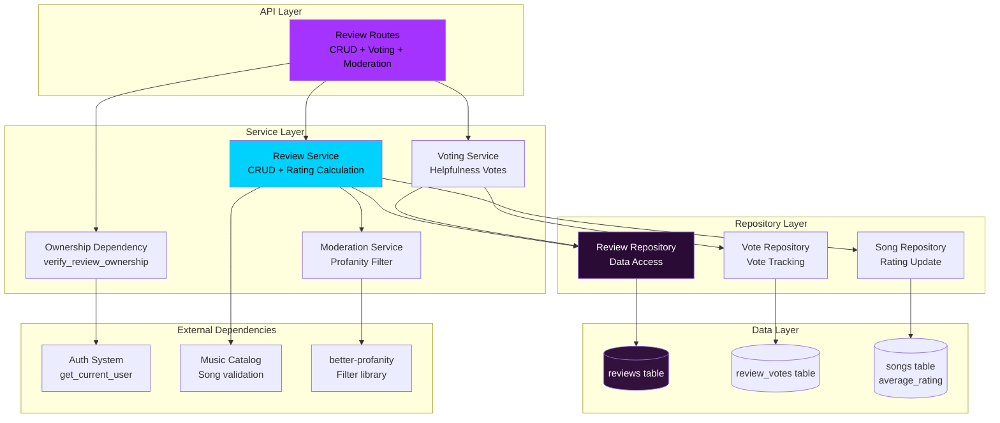
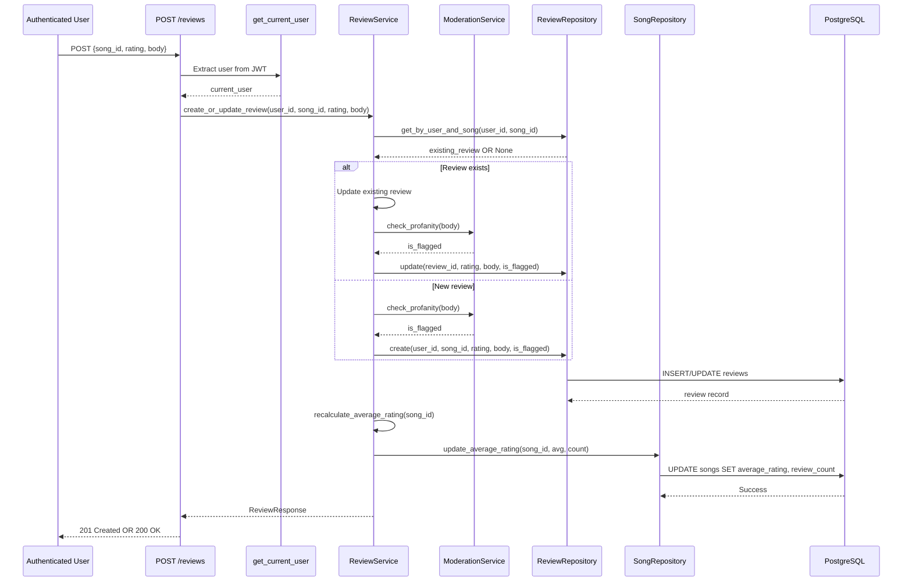
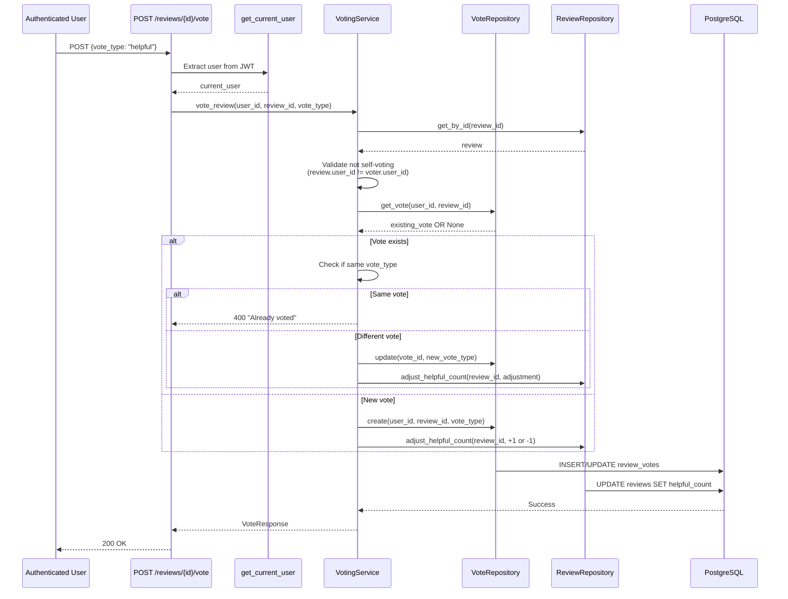

# Technical Design Document

## Overview

**Purpose**: This feature delivers review and rating capabilities for songs in The Sonic Immersive music catalog. Users can submit 1-5 star ratings with optional review text (up to 2000 characters), vote on review helpfulness, and discover quality music through aggregated ratings and peer reviews.

**Users**: Authenticated users rating and reviewing songs, browsing reviews to discover music, and voting on helpful reviews. Content moderators flag and manage inappropriate content. All users (including guests) view average ratings and public reviews.

**Impact**: Extends music-catalog-management with user-generated content, enabling community-driven music discovery. Introduces review ownership verification, content moderation, and helpfulness voting systems.

### Goals
- Enable authenticated users to rate and review songs (1-5 stars, 0-2000 char text)
- Calculate and display average song ratings with caching for performance
- Provide review helpfulness voting system (helpful/not helpful)
- Implement automatic profanity filtering and manual moderation workflow
- Enforce one review per user per song at database level

### Non-Goals
- Album or artist reviews (song reviews only)
- Threaded discussions or comments on reviews
- Review editing history or version control
- Social features (follow reviewers, review feeds)
- Review recommendation algorithm (sort by helpfulness only)

## Architecture

### Existing Architecture Analysis

This feature extends existing systems:

**music-catalog-management**:
- Uses songs table for catalog data
- Provides SongRepository for song validation
- Implements soft delete for songs (exclude from review queries)

**auth-security-foundation**:
- JWT authentication with get_current_user dependency
- Role-based access control for admin moderation endpoints

**user-playlists**:
- Ownership verification pattern (verify_playlist_ownership)
- Pagination strategy (offset-based, page/page_size params)

**Integration Points**:
- Reviews reference songs.id via foreign key
- Ownership verification uses auth get_current_user dependency
- Average rating stored in songs table (denormalized)
- Admin role required for moderation endpoints

### Architecture Pattern & Boundary Map

**Selected Pattern**: Clean Architecture with Repository Pattern



**Architecture Integration**:
- **Pattern**: Clean Architecture (Routes → Services → Repositories → Models) consistent with existing modules
- **Domain Boundaries**:
  - **Review Aggregate**: Review entity with votes collection and moderation state
  - **Ownership Boundary**: verify_review_ownership enforces author-only mutations
  - **Catalog Integration**: Validates song_id exists, updates average_rating in songs table
  - **Moderation Boundary**: ModerationService isolates profanity filtering logic
- **Existing Patterns Preserved**: Repository pattern, async SQLAlchemy, FastAPI dependency injection, offset-based pagination
- **New Components Rationale**:
  - ReviewService: CRUD operations, average rating recalculation
  - VotingService: Helpfulness vote management with count tracking
  - ModerationService: Profanity detection and flagging workflow
  - verify_review_ownership: Reusable dependency for author verification
- **Steering Compliance**: TDD mandatory, Clean Architecture separation, async patterns

### Technology Stack

| Layer | Choice / Version | Role in Feature | Notes |
|-------|------------------|-----------------|-------|
| Backend / Services | FastAPI + Python 3.10+ | API routes, dependency injection for ownership | Async/await for database operations |
| Backend / Services | SQLAlchemy 2.0 async ORM | Review, ReviewVote model definitions, relationships | AsyncSession for transactions |
| Data / Storage | PostgreSQL (Neon) | Relational storage for reviews, review_votes, ratings | Foreign keys, unique constraints, CHECK constraints |
| Backend / Services | Pydantic 2.x | Request/response schemas with validation | Validate rating (1-5), review text (0-2000 chars) |
| Backend / Services | better-profanity 0.7+ | Profanity detection for content moderation | Lightweight, customizable word list |
| Backend / Services | pytest + pytest-asyncio | TDD test framework for unit/integration tests | Mock repository for unit tests |

**Rationale**:
- **FastAPI**: Dependency injection ideal for ownership verification, consistent with existing modules
- **SQLAlchemy 2.0 async**: Consistent with catalog/playlists, supports transactions for average rating updates
- **PostgreSQL**: Unique constraint (user_id, song_id) enforces one review per user per song, CHECK constraint validates rating range
- **better-profanity**: Lightweight profanity filter (<1ms detection), sufficient for MVP without ML dependencies
- **Pydantic**: Custom validators for review text (strip whitespace, length validation)

## System Flows

### Create or Update Review Flow


**Key Decisions**:
- Check for existing review before create (upsert logic)
- Profanity check on create and update (flag if detected)
- Recalculate average rating synchronously after mutation
- Update songs table with new average and count (denormalized)

### Vote on Review Helpfulness Flow


**Key Decisions**:
- Prevent self-voting (review author cannot vote on own review)
- Allow vote changes (helpful → not helpful)
- Atomic adjustment of helpful_count (increment/decrement)
- Composite primary key (user_id, review_id) enforces one vote per user per review

## Requirements Traceability

| Requirement | Summary | Components | Interfaces | Flows |
|-------------|---------|------------|------------|-------|
| 1 | Review Creation | ReviewService, ReviewRepository, ModerationService | ReviewCreate, ReviewResponse | Create or Update Review |
| 2 | Review Update | ReviewService, ReviewRepository, verify_review_ownership | ReviewUpdate | Create or Update Review |
| 3 | Review Deletion | ReviewService, ReviewRepository, verify_review_ownership | - | - |
| 4 | Review Retrieval for Song | ReviewService, ReviewRepository | ReviewListResponse | - |
| 5 | Review Retrieval by User | ReviewService, ReviewRepository | ReviewListResponse | - |
| 6 | Average Rating Calculation | ReviewService, SongRepository | - | Create or Update Review |
| 7 | Helpfulness Voting | VotingService, VoteRepository, ReviewRepository | VoteRequest | Vote on Review |
| 8 | Content Moderation | ModerationService, ReviewRepository | - | Create or Update Review |
| 9 | Ownership Verification | verify_review_ownership | - | All mutation flows |
| 10 | One Review Per User Per Song | ReviewRepository (unique constraint) | - | Create or Update Review |
| 11 | Review Text Validation | Pydantic validators | ReviewCreate, ReviewUpdate | - |
| 12 | Review Display in Song Details | SongRepository (average_rating field) | SongResponse | - |

## Components and Interfaces

### Component Summary

| Component | Domain/Layer | Intent | Req Coverage | Key Dependencies (P0/P1) | Contracts |
|-----------|--------------|--------|--------------|--------------------------|-----------|
| ReviewService | Service | Business logic for review CRUD, average rating recalculation | 1, 2, 3, 4, 5, 6, 10 | ReviewRepository (P0), SongRepository (P0), ModerationService (P1) | Service Interface |
| VotingService | Service | Helpfulness vote management with count tracking | 7 | VoteRepository (P0), ReviewRepository (P0) | Service Interface |
| ModerationService | Service | Profanity detection and content flagging | 8 | better-profanity (P0) | Service Interface |
| ReviewRepository | Repository | Data access for reviews table | 1, 2, 3, 4, 5, 6, 10 | AsyncSession (P0) | Repository Interface |
| VoteRepository | Repository | Data access for review_votes table | 7 | AsyncSession (P0) | Repository Interface |
| verify_review_ownership | Middleware | FastAPI dependency verifying user owns review | 2, 3, 9 | get_current_user (P0), ReviewRepository (P0) | Dependency Function |
| Review (Model) | Data | SQLAlchemy model for reviews table | 1, 2, 3, 4, 5, 6, 10 | None (P0) | Data Model |
| ReviewVote (Model) | Data | SQLAlchemy model for review_votes table | 7 | None (P0) | Data Model |

---

### Service Layer

#### ReviewService

| Field | Detail |
|-------|--------|
| Intent | Orchestrates review CRUD operations, average rating recalculation, one-review-per-user-per-song enforcement |
| Requirements | 1, 2, 3, 4, 5, 6, 10 |
| Owner / Reviewers | Backend Team |

**Responsibilities & Constraints**
- Create or update review with validation (rating 1-5, body 0-2000 chars)
- Check for existing review by user and song (upsert logic)
- Recalculate average rating after create/update/delete
- Update songs table with new average_rating and review_count
- Retrieve reviews for song with pagination (default 10, max 50)
- Retrieve reviews by user with song details (title, artist)
- Delete review with ownership verification (hard delete)
- Integrate with ModerationService for profanity detection

**Dependencies**
- Outbound: ReviewRepository for review CRUD (P0)
- Outbound: SongRepository for average rating updates (P0)
- Outbound: ModerationService for profanity checking (P1)
- External: AsyncSession for database transactions (P0)

**Contracts**: Service Interface [X]

##### Service Interface
```python
class ReviewService:
    def __init__(
        self,
        review_repo: ReviewRepository,
        song_repo: SongRepository,
        moderation_service: ModerationService,
    ):
        self.review_repo = review_repo
        self.song_repo = song_repo
        self.moderation_service = moderation_service
    
    async def create_or_update_review(
        self, user_id: int, song_id: int, rating: int, body: Optional[str] = None
    ) -> tuple[Review, bool]:
        """
        Create new review or update existing. Returns (review, is_update).
        Recalculates average rating for song.
        """
        # Validate song exists
        song = await self.song_repo.get_by_id(song_id)
        if not song:
            raise ValueError("Song not found")
        
        # Check for existing review
        existing = await self.review_repo.get_by_user_and_song(user_id, song_id)
        
        # Check profanity
        is_flagged = self.moderation_service.check_profanity(body) if body else False
        
        if existing:
            # Update existing review
            existing.rating = rating
            existing.body = body.strip() if body else None
            existing.is_flagged = is_flagged
            existing.updated_at = datetime.now()
            review = existing
            is_update = True
        else:
            # Create new review
            review = await self.review_repo.create(
                user_id, song_id, rating, body.strip() if body else None, is_flagged
            )
            is_update = False
        
        # Recalculate average rating
        await self.recalculate_average_rating(song_id)
        
        return review, is_update
    
    async def delete_review(self, review_id: int) -> None:
        """Delete review. Ownership verified by dependency. Recalculates average."""
        review = await self.review_repo.get_by_id(review_id)
        if not review:
            raise ValueError("Review not found")
        
        song_id = review.song_id
        await self.review_repo.delete(review_id)
        await self.recalculate_average_rating(song_id)
    
    async def get_reviews_for_song(
        self, song_id: int, page: int = 1, page_size: int = 10
    ) -> tuple[list[Review], int]:
        """Retrieve reviews for song with pagination. Excludes flagged."""
        return await self.review_repo.get_by_song(song_id, page, page_size)
    
    async def get_reviews_by_user(
        self, user_id: int, page: int = 1, page_size: int = 10
    ) -> tuple[list[Review], int]:
        """Retrieve user's reviews with song details."""
        return await self.review_repo.get_by_user(user_id, page, page_size)
    
    async def recalculate_average_rating(self, song_id: int) -> None:
        """Recalculate average rating for song and update songs table."""
        avg_rating, count = await self.review_repo.calculate_average(song_id)
        await self.song_repo.update_average_rating(
            song_id, round(avg_rating, 1) if avg_rating else None, count
        )
```

**Implementation Notes**
- Integration: Reuses music-catalog SongRepository, auth get_current_user
- Validation: Rating (1-5) via Pydantic, text length (0-2000) via Pydantic, profanity via ModerationService
- Risks: Average rating recalculation failure leaves stale data (use transaction)

---

#### VotingService

| Field | Detail |
|-------|--------|
| Intent | Manages helpfulness votes with vote tracking, change handling, and count adjustment |
| Requirements | 7 |

**Responsibilities & Constraints**
- Create helpfulness vote (helpful or not_helpful)
- Update vote when user changes vote type
- Prevent duplicate votes (same vote_type)
- Prevent self-voting (review author cannot vote on own review)
- Adjust helpful_count atomically (increment/decrement)
- Track all votes in review_votes table

**Dependencies**
- Outbound: VoteRepository for vote CRUD (P0)
- Outbound: ReviewRepository for helpful_count updates (P0)
- External: AsyncSession for database transactions (P0)

**Contracts**: Service Interface [X]

##### Service Interface
```python
class VotingService:
    def __init__(
        self,
        vote_repo: VoteRepository,
        review_repo: ReviewRepository,
    ):
        self.vote_repo = vote_repo
        self.review_repo = review_repo
    
    async def vote_review(
        self, user_id: int, review_id: int, vote_type: Literal["helpful", "not_helpful"]
    ) -> None:
        """Vote on review helpfulness. Prevents self-voting and duplicate votes."""
        # Get review
        review = await self.review_repo.get_by_id(review_id)
        if not review:
            raise ValueError("Review not found")
        
        # Prevent self-voting
        if review.user_id == user_id:
            raise ValueError("Cannot vote on your own review")
        
        # Convert vote_type to numeric
        vote_value = 1 if vote_type == "helpful" else -1
        
        # Check for existing vote
        existing_vote = await self.vote_repo.get_vote(user_id, review_id)
        
        if existing_vote:
            # Vote already exists
            if existing_vote.vote_type == vote_value:
                raise ValueError(f"You have already voted this review as {vote_type}")
            
            # Change vote
            old_value = existing_vote.vote_type
            existing_vote.vote_type = vote_value
            await self.vote_repo.update(existing_vote)
            
            # Adjust helpful_count: remove old vote, add new vote
            adjustment = vote_value - old_value  # e.g., 1 - (-1) = 2
            await self.review_repo.adjust_helpful_count(review_id, adjustment)
        else:
            # New vote
            await self.vote_repo.create(user_id, review_id, vote_value)
            await self.review_repo.adjust_helpful_count(review_id, vote_value)
```

**Implementation Notes**
- Integration: Atomic helpful_count adjustment prevents race conditions
- Validation: Self-voting check, duplicate vote prevention
- Risks: Race condition on concurrent votes (use database transaction)

---

#### ModerationService

| Field | Detail |
|-------|--------|
| Intent | Profanity detection and content flagging for review moderation workflow |
| Requirements | 8 |

**Responsibilities & Constraints**
- Check review text for profanity using better-profanity library
- Return boolean indicating if content should be flagged
- Maintain custom word list for platform-specific profanity
- Log flagged reviews for admin review queue

**Dependencies**
- External: better-profanity library (P0)

**Contracts**: Service Interface [X]

##### Service Interface
```python
from better_profanity import profanity

class ModerationService:
    def __init__(self):
        profanity.load_censor_words()  # Load default word list
    
    def check_profanity(self, text: str) -> bool:
        """Check if text contains profanity. Returns True if flagged."""
        if not text:
            return False
        return profanity.contains_profanity(text)
    
    def add_custom_words(self, words: list[str]) -> None:
        """Add platform-specific profanity words."""
        profanity.add_censor_words(words)
```

**Implementation Notes**
- Integration: Called synchronously during review create/update (<1ms)
- Validation: None (library handles detection)
- Risks: False positives (e.g., "Scunthorpe problem"), maintain whitelist

---

### Repository Layer

#### ReviewRepository

| Field | Detail |
|-------|--------|
| Intent | Data access layer for reviews table with CRUD, pagination, and average calculation |
| Requirements | 1, 2, 3, 4, 5, 6, 10 |

**Responsibilities & Constraints**
- Create review with unique constraint enforcement (user_id, song_id)
- Retrieve review by ID or by user and song
- Update review rating, body, is_flagged, updated_at
- Delete review (hard delete)
- Get reviews for song with pagination (exclude flagged)
- Get reviews by user with song details (join songs, albums, artists)
- Calculate average rating and review count for song
- Adjust helpful_count atomically

**Dependencies**
- External: AsyncSession for database operations (P0)

**Contracts**: Repository Interface [X]

##### Repository Interface
```python
class ReviewRepository:
    def __init__(self, db: AsyncSession):
        self.db = db
    
    async def create(
        self, user_id: int, song_id: int, rating: int, body: Optional[str], is_flagged: bool = False
    ) -> Review:
        """Create new review. Unique constraint (user_id, song_id) enforced at DB level."""
        review = Review(
            user_id=user_id,
            song_id=song_id,
            rating=rating,
            body=body,
            is_flagged=is_flagged,
            helpful_count=0,
            created_at=datetime.now(),
            updated_at=datetime.now(),
        )
        self.db.add(review)
        await self.db.commit()
        await self.db.refresh(review)
        return review
    
    async def get_by_id(self, review_id: int) -> Optional[Review]:
        """Retrieve review by ID."""
        result = await self.db.execute(
            select(Review).where(Review.id == review_id)
        )
        return result.scalar_one_or_none()
    
    async def get_by_user_and_song(self, user_id: int, song_id: int) -> Optional[Review]:
        """Check if user already reviewed song."""
        result = await self.db.execute(
            select(Review)
            .where(Review.user_id == user_id)
            .where(Review.song_id == song_id)
        )
        return result.scalar_one_or_none()
    
    async def get_by_song(
        self, song_id: int, page: int, page_size: int
    ) -> tuple[list[Review], int]:
        """Retrieve reviews for song with pagination. Excludes flagged."""
        query = (
            select(Review)
            .where(Review.song_id == song_id)
            .where(Review.is_flagged == False)
            .order_by(Review.created_at.desc())
        )
        
        total = await self.db.execute(select(func.count()).select_from(query.subquery()))
        total_count = total.scalar()
        
        paginated = query.limit(page_size).offset((page - 1) * page_size)
        result = await self.db.execute(paginated)
        reviews = result.scalars().all()
        return reviews, total_count
    
    async def get_by_user(
        self, user_id: int, page: int, page_size: int
    ) -> tuple[list[Review], int]:
        """Retrieve user's reviews with song details."""
        query = (
            select(Review)
            .options(selectinload(Review.song))
            .where(Review.user_id == user_id)
            .order_by(Review.created_at.desc())
        )
        
        total = await self.db.execute(select(func.count()).select_from(query.subquery()))
        total_count = total.scalar()
        
        paginated = query.limit(page_size).offset((page - 1) * page_size)
        result = await self.db.execute(paginated)
        reviews = result.scalars().all()
        return reviews, total_count
    
    async def delete(self, review_id: int) -> bool:
        """Delete review (hard delete)."""
        review = await self.get_by_id(review_id)
        if not review:
            return False
        await self.db.delete(review)
        await self.db.commit()
        return True
    
    async def calculate_average(self, song_id: int) -> tuple[Optional[float], int]:
        """Calculate average rating and review count for song. Excludes flagged."""
        result = await self.db.execute(
            select(func.avg(Review.rating), func.count(Review.id))
            .where(Review.song_id == song_id)
            .where(Review.is_flagged == False)
        )
        avg_rating, count = result.one()
        return avg_rating, count or 0
    
    async def adjust_helpful_count(self, review_id: int, adjustment: int) -> None:
        """Adjust helpful_count atomically (increment/decrement)."""
        await self.db.execute(
            update(Review)
            .where(Review.id == review_id)
            .values(helpful_count=Review.helpful_count + adjustment)
        )
        await self.db.commit()
```

**Implementation Notes**
- Integration: Joins with songs, albums, artists for user review list
- Validation: Database enforces unique constraint (user_id, song_id)
- Risks: Unique constraint violation if concurrent creates (handled by application check)

---

#### VoteRepository

| Field | Detail |
|-------|--------|
| Intent | Data access layer for review_votes table with vote tracking and updates |
| Requirements | 7 |

**Responsibilities & Constraints**
- Create vote with composite primary key (user_id, review_id)
- Retrieve vote by user and review
- Update vote type (helpful ↔ not_helpful)
- Support vote changes without duplicate entries

**Dependencies**
- External: AsyncSession for database operations (P0)

**Contracts**: Repository Interface [X]

##### Repository Interface
```python
class VoteRepository:
    def __init__(self, db: AsyncSession):
        self.db = db
    
    async def create(self, user_id: int, review_id: int, vote_type: int) -> ReviewVote:
        """Create vote. vote_type: 1 (helpful) or -1 (not_helpful)."""
        vote = ReviewVote(
            user_id=user_id,
            review_id=review_id,
            vote_type=vote_type,
            created_at=datetime.now(),
        )
        self.db.add(vote)
        await self.db.commit()
        await self.db.refresh(vote)
        return vote
    
    async def get_vote(self, user_id: int, review_id: int) -> Optional[ReviewVote]:
        """Retrieve user's vote on review."""
        result = await self.db.execute(
            select(ReviewVote)
            .where(ReviewVote.user_id == user_id)
            .where(ReviewVote.review_id == review_id)
        )
        return result.scalar_one_or_none()
    
    async def update(self, vote: ReviewVote) -> None:
        """Update vote type."""
        await self.db.commit()
        await self.db.refresh(vote)
```

**Implementation Notes**
- Integration: Composite primary key (user_id, review_id) enforced at DB level
- Validation: None (enforced by database constraints)
- Risks: None (simple CRUD operations)

---

### Middleware Layer

#### verify_review_ownership

| Field | Detail |
|-------|--------|
| Intent | FastAPI dependency verifying authenticated user owns review before allowing mutations |
| Requirements | 2, 3, 9 |

**Responsibilities & Constraints**
- Extract current_user from JWT via get_current_user dependency
- Fetch review by ID from database
- Compare review.user_id with current_user.id
- Raise HTTPException(403) if ownership verification fails
- Raise HTTPException(404) if review does not exist
- Return verified review to route handler (avoids duplicate query)

**Dependencies**
- Inbound: Update/delete route handlers (P0)
- Outbound: get_current_user from auth-security-foundation (P0)
- Outbound: ReviewRepository for review lookup (P0)

**Contracts**: Dependency Function [X]

##### Dependency Function
```python
async def verify_review_ownership(
    review_id: int,
    current_user: User = Depends(get_current_user),
    db: AsyncSession = Depends(get_db),
) -> Review:
    """Verify current user owns review. Raises 403 if not owner, 404 if not found."""
    review_repo = ReviewRepository(db)
    review = await review_repo.get_by_id(review_id)
    
    if not review:
        raise HTTPException(status_code=404, detail="Review not found")
    
    if review.user_id != current_user.id:
        raise HTTPException(
            status_code=403,
            detail="You do not own this review"
        )
    
    return review
```

**Implementation Notes**
- Integration: Composes with get_current_user via FastAPI Depends
- Validation: Ensures user_id == current_user.id before proceeding
- Risks: Extra database query adds latency (50-100ms), acceptable for MVP

---

## Data Models

### Domain Model

**Review Aggregate**:
- **Aggregate Root**: Review entity
- **Entities**: ReviewVote (child entities, tracked separately)
- **Value Objects**: Rating (1-5), ReviewText (0-2000 chars)
- **Invariants**:
  - Rating must be 1-5 (enforced by CHECK constraint)
  - One review per user per song (enforced by UNIQUE constraint)
  - Review body 0-2000 characters (Pydantic validation)
  - Flagged reviews excluded from public queries

**Relationships**:
- Review → User (many-to-one, author)
- Review → Song (many-to-one, subject of review)
- Review → ReviewVotes (one-to-many, helpfulness votes)
- Song → Reviews (one-to-many, average rating calculated from)

### Logical Data Model

**Structure Definition**:
- **Reviews Entity**:
  - Attributes: id (PK), user_id (FK), song_id (FK), rating, body, is_flagged, helpful_count, created_at, updated_at
  - Cardinality: User (1) → Reviews (*), Song (1) → Reviews (*)
  - Unique constraint: (user_id, song_id)
- **ReviewVotes Entity**:
  - Attributes: user_id (PK, FK), review_id (PK, FK), vote_type, created_at
  - Cardinality: Review (1) → ReviewVotes (*)
  - Composite primary key: (user_id, review_id)
- **Songs Entity (extended)**:
  - New attributes: average_rating (DECIMAL), review_count (INTEGER)
- **Natural Keys**:
  - Review: id (surrogate primary key, auto-increment)
  - ReviewVote: (user_id, review_id) composite primary key
- **Referential Integrity**:
  - reviews.user_id → users.id (ON DELETE CASCADE)
  - reviews.song_id → songs.id (ON DELETE CASCADE)
  - review_votes.user_id → users.id (ON DELETE CASCADE)
  - review_votes.review_id → reviews.id (ON DELETE CASCADE)

**Consistency & Integrity**:
- **Transaction Boundaries**: Review + average rating update (atomic)
- **Cascading Rules**: Delete user → cascade delete reviews and votes
- **Temporal Aspects**: created_at (immutable), updated_at (modified on updates)

### Physical Data Model

**For PostgreSQL (Neon)**:

```sql
-- Reviews table
CREATE TABLE reviews (
  id SERIAL PRIMARY KEY,
  user_id INTEGER NOT NULL REFERENCES users(id) ON DELETE CASCADE,
  song_id INTEGER NOT NULL REFERENCES songs(id) ON DELETE CASCADE,
  rating SMALLINT NOT NULL CHECK (rating >= 1 AND rating <= 5),
  body TEXT,  -- Optional review text (0-2000 chars validated by app)
  is_flagged BOOLEAN NOT NULL DEFAULT FALSE,
  helpful_count INTEGER NOT NULL DEFAULT 0,
  created_at TIMESTAMPTZ DEFAULT NOW(),
  updated_at TIMESTAMPTZ DEFAULT NOW(),
  CONSTRAINT unique_user_song UNIQUE(user_id, song_id)
);

-- Indexes for reviews
CREATE INDEX idx_reviews_song ON reviews(song_id);
CREATE INDEX idx_reviews_user ON reviews(user_id);
CREATE INDEX idx_reviews_flagged ON reviews(is_flagged) WHERE is_flagged = TRUE;

-- ReviewVotes table
CREATE TABLE review_votes (
  user_id INTEGER NOT NULL REFERENCES users(id) ON DELETE CASCADE,
  review_id INTEGER NOT NULL REFERENCES reviews(id) ON DELETE CASCADE,
  vote_type SMALLINT NOT NULL,  -- 1 (helpful) or -1 (not_helpful)
  created_at TIMESTAMPTZ DEFAULT NOW(),
  PRIMARY KEY (user_id, review_id)
);

-- Indexes for review_votes
CREATE INDEX idx_review_votes_review ON review_votes(review_id);

-- Extend songs table with average rating
ALTER TABLE songs ADD COLUMN average_rating DECIMAL(3,1);
ALTER TABLE songs ADD COLUMN review_count INTEGER DEFAULT 0;
```

**SQLAlchemy Models**:

```python
from sqlalchemy import Column, Integer, String, Boolean, ForeignKey, TIMESTAMP, CheckConstraint, Text, DECIMAL, SmallInteger
from sqlalchemy.orm import relationship
from datetime import datetime

class Review(Base):
    __tablename__ = "reviews"
    
    id = Column(Integer, primary_key=True, autoincrement=True)
    user_id = Column(Integer, ForeignKey("users.id", ondelete="CASCADE"), nullable=False)
    song_id = Column(Integer, ForeignKey("songs.id", ondelete="CASCADE"), nullable=False)
    rating = Column(SmallInteger, nullable=False)
    body = Column(Text, nullable=True)
    is_flagged = Column(Boolean, nullable=False, default=False)
    helpful_count = Column(Integer, nullable=False, default=0)
    created_at = Column(TIMESTAMP(timezone=True), default=datetime.now)
    updated_at = Column(TIMESTAMP(timezone=True), default=datetime.now, onupdate=datetime.now)
    
    __table_args__ = (
        CheckConstraint('rating >= 1 AND rating <= 5', name='rating_range'),
        UniqueConstraint('user_id', 'song_id', name='unique_user_song'),
    )
    
    # Relationships
    user = relationship("User", back_populates="reviews")
    song = relationship("Song", back_populates="reviews")
    votes = relationship("ReviewVote", back_populates="review", cascade="all, delete-orphan")

class ReviewVote(Base):
    __tablename__ = "review_votes"
    
    user_id = Column(Integer, ForeignKey("users.id", ondelete="CASCADE"), primary_key=True)
    review_id = Column(Integer, ForeignKey("reviews.id", ondelete="CASCADE"), primary_key=True)
    vote_type = Column(SmallInteger, nullable=False)  # 1 or -1
    created_at = Column(TIMESTAMP(timezone=True), default=datetime.now)
    
    # Relationships
    user = relationship("User")
    review = relationship("Review", back_populates="votes")

# Extend Song model
class Song(Base):
    # ... existing fields
    average_rating = Column(DECIMAL(3, 1), nullable=True)
    review_count = Column(Integer, default=0)
    
    # Relationships
    reviews = relationship("Review", back_populates="song")
```

**Index Strategy**:
- `idx_reviews_song`: Optimize queries for reviews by song
- `idx_reviews_user`: Optimize queries for user's reviews
- `idx_reviews_flagged`: Partial index for moderation queue (flagged reviews only)
- `idx_review_votes_review`: Optimize vote count queries

### Data Contracts & Integration

**API Data Transfer**:

```typescript
// Request Schemas
interface ReviewCreateRequest {
  song_id: number;
  rating: number;  // 1-5
  body?: string;   // 0-2000 characters, optional
}

interface ReviewUpdateRequest {
  rating?: number;  // 1-5
  body?: string;    // 0-2000 characters
}

interface VoteRequest {
  vote_type: "helpful" | "not_helpful";
}

// Response Schemas
interface ReviewResponse {
  id: number;
  user_id: number;
  username: string;
  song_id: number;
  rating: number;
  body: string | null;
  helpful_count: number;
  is_flagged: boolean;  // Hidden from public
  created_at: string;   // ISO 8601
  updated_at: string;   // ISO 8601
}

interface ReviewListResponse {
  items: ReviewResponse[];
  total_count: number;
  page: number;
  page_size: number;
  total_pages: number;
}

interface SongWithRating {
  // ... existing song fields
  average_rating: number | null;  // 1 decimal place
  review_count: number;
}
```

**Cross-Service Data Management**:
- **music-catalog integration**: Validate song_id exists, update average_rating in songs table
- **auth-security integration**: Extract user_id from JWT for ownership verification
- **Eventual consistency**: Average rating recalculated synchronously after review mutation

## Error Handling

### Error Strategy

All errors follow FastAPI HTTPException pattern with appropriate status codes and descriptive messages.

### Error Categories and Responses

**User Errors (4xx)**:
- **400 Bad Request**: Invalid rating (outside 1-5), invalid body length (>2000 chars), duplicate vote (same vote_type)
- **401 Unauthorized**: Missing or invalid JWT token (handled by get_current_user)
- **403 Forbidden**: User not review author for update/delete, self-voting attempt
- **404 Not Found**: Review ID not found, song ID not found in catalog

**System Errors (5xx)**:
- **500 Internal Server Error**: Database connection failure, average rating calculation failure

**Business Logic Errors (422)**:
- **422 Unprocessable Entity**: Review flagged for profanity (auto-moderation), song soft-deleted (cannot review)

### Monitoring

- Log all 403 errors (potential security issue if frequent)
- Log all review flagging events (moderation queue)
- Monitor average rating calculation failures (alert if >1% of mutations)
- Monitor profanity detection false positive rate (review sample weekly)

## Testing Strategy

### Unit Tests
- **ReviewService.create_or_update_review**:
  - Creates new review with valid data
  - Updates existing review (preserves created_at)
  - Returns is_update=true when updating
  - Flags review if profanity detected
  - Recalculates average rating after mutation
  
- **VotingService.vote_review**:
  - Creates new vote (adjusts helpful_count +1 or -1)
  - Changes vote type (adjusts helpful_count by difference)
  - Prevents duplicate vote (same vote_type)
  - Prevents self-voting (review.user_id == voter.user_id)
  
- **ModerationService.check_profanity**:
  - Returns true for text containing profanity
  - Returns false for clean text
  - Handles empty text (returns false)
  
- **verify_review_ownership**:
  - Returns review if user_id matches current_user.id
  - Raises 403 if user_id != current_user.id
  - Raises 404 if review_id not found

### Integration Tests
- **POST /reviews**:
  - Creates review with authenticated user as author
  - Updates review if user already reviewed song
  - Returns 201 Created (new) or 200 OK (update)
  - Returns 400 if rating outside 1-5
  - Returns 400 if song_id not found
  
- **GET /songs/{id}/reviews**:
  - Returns paginated reviews for song
  - Excludes flagged reviews
  - Orders by created_at DESC
  - Includes username for each review
  
- **POST /reviews/{id}/vote**:
  - Creates vote and adjusts helpful_count
  - Returns 400 if duplicate vote
  - Returns 403 if self-voting
  
- **DELETE /reviews/{id}**:
  - Deletes review (hard delete)
  - Returns 403 if user not author
  - Recalculates average rating after deletion
  
- **GET /users/me/reviews**:
  - Returns user's reviews with song details
  - Paginated with default 10 per page

### E2E/UI Tests
- **Review Management Flow**:
  - User creates review → views on song page → updates review → deletes review
  - Average rating updates after each mutation
  
- **Helpfulness Voting Flow**:
  - User A creates review → User B votes helpful → helpful_count increments
  - User B changes vote to not_helpful → helpful_count decrements
  
- **Content Moderation Flow**:
  - User submits review with profanity → review flagged automatically
  - Flagged review hidden from public → admin approves → review visible
  
- **One Review Per User Enforcement**:
  - User submits two reviews for same song → second submission updates first review
  - created_at preserved, updated_at modified

### Performance/Load Tests
- **Average Rating Calculation**:
  - Calculate average for song with 10k reviews → <100ms
  
- **Review Pagination**:
  - Retrieve page 1 of 10k reviews → <200ms
  - Retrieve page 100 of 10k reviews → <300ms
  
- **Concurrent Voting**:
  - 100 concurrent votes on same review → no race conditions, correct helpful_count
  
- **Profanity Detection**:
  - Check 1000 reviews for profanity → <1s total (<1ms per review)

## Security Considerations

**Ownership Verification**:
- All mutation operations (update, delete) verify ownership via FastAPI dependency
- verify_review_ownership extracts user_id from JWT and compares with review.user_id
- 403 Forbidden returned if ownership verification fails

**Self-Voting Prevention**:
- VotingService checks review.user_id != voter.user_id before allowing vote
- Prevents review authors from inflating helpful_count on own reviews

**SQL Injection Prevention**:
- SQLAlchemy ORM uses parameterized queries (no manual SQL construction)
- Pydantic validation sanitizes input (rating, body length)

**XSS Prevention**:
- Review body stored as plain text (no HTML allowed)
- Frontend escapes review text on display (React automatic escaping)
- Future: Use bleach library for HTML sanitization if rich text added

**Content Moderation**:
- Automatic profanity detection flags inappropriate content
- Flagged reviews hidden from public (WHERE is_flagged = false)
- Admin role required for moderation endpoints (approve/delete flagged reviews)

## Performance & Scalability

**Target Metrics**:
- **Review CRUD**: <300ms for 95% of requests (Requirement Non-Functional Performance 1)
- **Average Rating Calculation**: <100ms (Requirement Non-Functional Performance 2)
- **Helpfulness Voting**: <200ms (Requirement Non-Functional Performance 3)

**Optimization Strategies**:
- **Denormalized Average Rating**: Store in songs table (fast reads, no aggregate query)
- **Pagination**: Default 10 reviews/page (max 50) reduces data transfer
- **Indexes**: (song_id), (user_id), (is_flagged) optimize queries
- **Atomic helpful_count**: Use UPDATE SET helpful_count = helpful_count + ? (no race conditions)

**Scalability**:
- **Per-song limit**: 10,000 reviews per song (Requirement Non-Functional Scalability 1)
- **Cached ratings**: Average rating cached in songs table with 5-minute TTL (future: Redis cache)
- **Pagination**: Offset-based sufficient for 10k reviews (cursor-based if performance degrades)

## Supporting References

### Average Rating Recalculation SQL

```sql
-- Recalculate average rating and review count for song
WITH review_stats AS (
  SELECT 
    AVG(rating) AS avg_rating,
    COUNT(id) AS review_count
  FROM reviews
  WHERE song_id = ?
    AND is_flagged = FALSE
)
UPDATE songs
SET 
  average_rating = ROUND((SELECT avg_rating FROM review_stats), 1),
  review_count = (SELECT review_count FROM review_stats)
WHERE id = ?;
```

### Vote Change Adjustment Logic

```python
# User changes vote from not_helpful (-1) to helpful (+1)
old_vote_type = -1
new_vote_type = 1
adjustment = new_vote_type - old_vote_type  # 1 - (-1) = 2

# Update helpful_count atomically
UPDATE reviews SET helpful_count = helpful_count + adjustment WHERE id = ?

# Examples:
# - helpful → not_helpful: adjustment = -1 - 1 = -2
# - not_helpful → helpful: adjustment = 1 - (-1) = 2
# - new helpful vote: adjustment = 1
# - new not_helpful vote: adjustment = -1
```

### Profanity Detection Integration

```python
from better_profanity import profanity

# Load profanity word list (run once at app startup)
profanity.load_censor_words()

# Optional: Add custom words
profanity.add_censor_words(["customword1", "customword2"])

# Check text for profanity
text = "This is a sample review text"
is_profane = profanity.contains_profanity(text)  # Returns boolean

# Censor text (for logging/debugging)
censored = profanity.censor(text)  # Replaces profanity with ****
```

### Unique Constraint Handling

```python
from sqlalchemy.exc import IntegrityError

try:
    review = await review_repo.create(user_id, song_id, rating, body)
except IntegrityError as e:
    if "unique_user_song" in str(e):
        # User already reviewed this song, update instead
        existing = await review_repo.get_by_user_and_song(user_id, song_id)
        existing.rating = rating
        existing.body = body
        existing.updated_at = datetime.now()
        await db.commit()
        return existing
    else:
        raise
```
