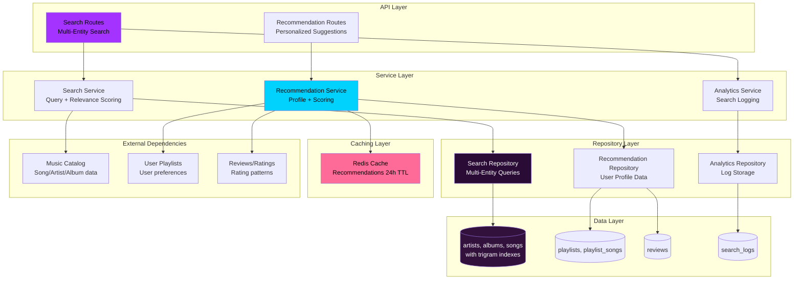
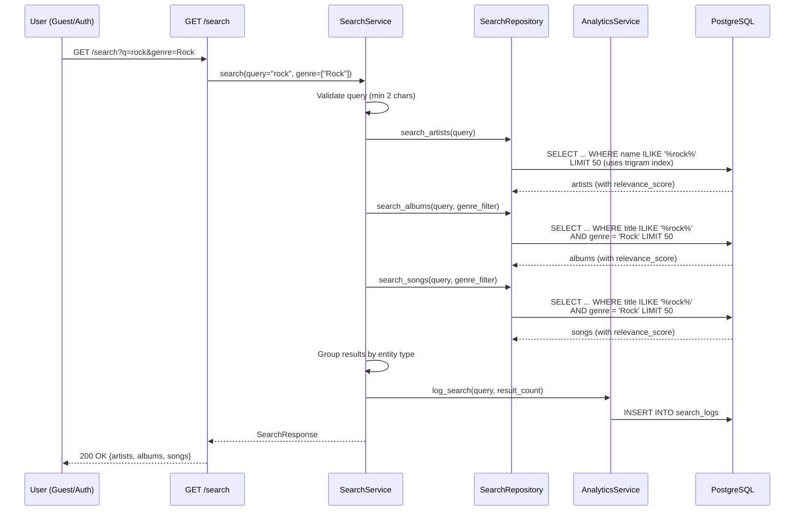
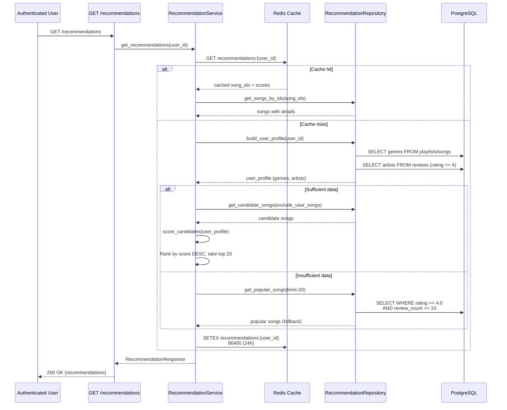

# Technical Design Document

## Overview

**Purpose**: This feature delivers comprehensive search capabilities across catalog entities (artists, albums, songs) and a personalized recommendation engine for The Sonic Immersive platform. Search provides case-insensitive partial matching with genre/year filtering and relevance ranking (<300ms response time). Recommendations analyze user playlists and review history to suggest new music with fallback to popular songs for new users.

**Users**: All users (including guests) perform multi-entity search with filtering. Authenticated users receive personalized recommendations based on listening history. Product managers analyze search analytics for quality improvement.

**Impact**: Completes music discovery experience by enabling catalog search and personalized recommendations. Integrates with music-catalog-management, user-playlists, and reviews-ratings to provide comprehensive music discovery.

### Goals
- Enable fast multi-entity search (<300ms) across artists, albums, songs
- Provide relevance-ranked search results with filtering (genre, year)
- Generate personalized recommendations from user playlists and reviews
- Implement fallback strategy for users with insufficient data
- Cache recommendations (24-hour TTL) for performance

### Non-Goals
- Voice search or natural language queries
- Image-based search (album cover recognition)
- Real-time collaborative filtering (user-based similarity)
- Playlist auto-generation from recommendations
- Mobile app-specific search features (location, AR)

## Architecture

### Existing Architecture Analysis

This feature integrates multiple existing systems:

**music-catalog-management**:
- Trigram GIN indexes on artists.name, albums.title, songs.title (reuse for search)
- Song, Album, Artist repositories for data access
- Soft delete pattern (exclude deleted songs from search/recommendations)

**user-playlists**:
- Playlist-song relationships for recommendation input
- User's playlist contents analyzed for favorite genres/artists

**reviews-ratings**:
- Review and rating data for recommendation scoring
- Average_rating and review_count used for popularity signals
- High-rated songs (4-5 stars) identify user preferences

**auth-security-foundation**:
- JWT authentication for personalized recommendations
- Redis cache infrastructure (reuse for recommendation caching)

**Integration Points**:
- Search queries use trigram indexes from music-catalog-management
- Recommendations analyze playlists, reviews, ratings from user-playlists and reviews-ratings
- Redis caching from auth-security-foundation used for recommendation storage

### Architecture Pattern & Boundary Map

**Selected Pattern**: Clean Architecture with Service Pattern + Caching Layer



**Architecture Integration**:
- **Pattern**: Clean Architecture (Routes → Services → Repositories → Data) consistent with existing modules
- **Domain Boundaries**:
  - **Search Boundary**: Multi-entity queries with relevance scoring, genre/year filtering
  - **Recommendation Boundary**: User profile extraction, candidate scoring, caching
  - **Analytics Boundary**: Search query logging, PII sanitization
- **Existing Patterns Preserved**: Repository pattern, async SQLAlchemy, Redis caching, offset pagination
- **New Components Rationale**:
  - SearchService: Multi-entity search orchestration, relevance scoring
  - RecommendationService: User profile building, candidate scoring, cache management
  - AnalyticsService: Search query logging with PII detection
- **Steering Compliance**: TDD mandatory, Clean Architecture separation, async patterns

### Technology Stack

| Layer | Choice / Version | Role in Feature | Notes |
|-------|------------------|-----------------|-------|
| Backend / Services | FastAPI + Python 3.10+ | API routes, async search and recommendation generation | Async/await for database and cache operations |
| Backend / Services | SQLAlchemy 2.0 async ORM | Multi-entity queries with UNION ALL, user profile extraction | AsyncSession for transactions |
| Data / Storage | PostgreSQL (Neon) + pg_trgm | Trigram GIN indexes for partial match search | Reuse indexes from music-catalog-management |
| Backend / Services | Redis 7.x | Recommendation result caching (24-hour TTL) | Reuse from auth-security-foundation |
| Backend / Services | Pydantic 2.x | Request/response validation, genre enum, year range validation | Custom validators for search parameters |
| Backend / Services | pytest + pytest-asyncio | TDD test framework for search and recommendation logic | Mock repository and cache in unit tests |

**Rationale**:
- **PostgreSQL pg_trgm**: Trigram GIN indexes already created, proven <300ms performance for 100k records
- **Redis**: Already available from auth module, fast caching with TTL support
- **UNION ALL**: PostgreSQL optimizes parallel execution for multi-entity search
- **Content-based filtering**: Simple scoring algorithm sufficient for MVP, no ML dependencies

## System Flows

### Multi-Entity Search Flow


**Key Decisions**:
- Validate query minimum 2 characters (prevents excessive wildcards)
- Execute three queries (artists, albums, songs) with UNION ALL (parallel execution)
- Apply genre filter after relevance scoring
- Calculate relevance_score in SQL (exact > prefix > contains)
- Log search query asynchronously (non-blocking)

### Personalized Recommendation Flow


**Key Decisions**:
- Check cache first (Redis GET)
- Build user profile from playlists (genres) and reviews (artists with rating >= 4)
- Score candidates with weighted algorithm (genre 40%, artist 30%, rating 20%, popularity 10%)
- Fallback to popular songs if user has <3 playlists and <3 reviews
- Cache result with 24-hour TTL (daily refresh)

## Requirements Traceability

| Requirement | Summary | Components | Interfaces | Flows |
|-------------|---------|------------|------------|-------|
| 1 | Multi-Entity Search | SearchService, SearchRepository | SearchRequest, SearchResponse | Multi-Entity Search |
| 2 | Search Result Ranking | SearchService | SearchResponse (relevance_score) | Multi-Entity Search |
| 3 | Genre Filtering | SearchService, SearchRepository | GenreFilter | Multi-Entity Search |
| 4 | Release Year Filtering | SearchService, SearchRepository | YearRangeFilter | Multi-Entity Search |
| 5 | Search Sorting | SearchService, SearchRepository | SortParameter | Multi-Entity Search |
| 6 | Personalized Recommendations | RecommendationService, RecommendationRepository | RecommendationResponse | Personalized Recommendation |
| 7 | Recommendation Scoring | RecommendationService | - | Personalized Recommendation |
| 8 | Recommendation Fallback | RecommendationService, RecommendationRepository | - | Personalized Recommendation |
| 9 | Recommendation Performance | RecommendationService, Redis Cache | - | Personalized Recommendation |
| 10 | Recommendation Explanation | RecommendationService | RecommendationResponse (reason) | - |
| 11 | Recommendation Feedback | FeedbackService, FeedbackRepository | FeedbackRequest | - |
| 12 | Search Analytics | AnalyticsService, AnalyticsRepository | - | Multi-Entity Search |

## Components and Interfaces

### Component Summary

| Component | Domain/Layer | Intent | Req Coverage | Key Dependencies (P0/P1) | Contracts |
|-----------|--------------|--------|--------------|--------------------------|-----------|
| SearchService | Service | Multi-entity search orchestration with relevance scoring and filtering | 1, 2, 3, 4, 5 | SearchRepository (P0), AnalyticsService (P1) | Service Interface |
| RecommendationService | Service | User profile building, candidate scoring, caching | 6, 7, 8, 9, 10 | RecommendationRepository (P0), Redis (P0) | Service Interface |
| AnalyticsService | Service | Search query logging with PII detection | 12 | AnalyticsRepository (P0) | Service Interface |
| FeedbackService | Service | Recommendation feedback tracking | 11 | FeedbackRepository (P0) | Service Interface |
| SearchRepository | Repository | Multi-entity queries with UNION ALL | 1, 2, 3, 4, 5 | AsyncSession (P0) | Repository Interface |
| RecommendationRepository | Repository | User profile extraction from playlists and reviews | 6, 7, 8 | AsyncSession (P0) | Repository Interface |

---

### Service Layer

#### SearchService

| Field | Detail |
|-------|--------|
| Intent | Orchestrates multi-entity search across artists, albums, songs with relevance scoring, filtering, and sorting |
| Requirements | 1, 2, 3, 4, 5 |
| Owner / Reviewers | Backend Team |

**Responsibilities & Constraints**
- Execute multi-entity search with UNION ALL (artists, albums, songs)
- Calculate relevance score (exact match > prefix > contains + popularity boost)
- Apply genre filter (multiple selection with OR logic)
- Apply release year filter (min/max range for albums)
- Support sorting (relevance, popularity, release_date, rating)
- Validate search query minimum 2 characters
- Return maximum 50 results per entity type
- Integrate with AnalyticsService for query logging

**Dependencies**
- Outbound: SearchRepository for multi-entity queries (P0)
- Outbound: AnalyticsService for search logging (P1)
- External: AsyncSession for database operations (P0)

**Contracts**: Service Interface [X]

##### Service Interface
```python
class SearchService:
    def __init__(
        self,
        search_repo: SearchRepository,
        analytics_service: AnalyticsService,
    ):
        self.search_repo = search_repo
        self.analytics_service = analytics_service
    
    async def search(
        self,
        query: str,
        genres: Optional[list[str]] = None,
        year_min: Optional[int] = None,
        year_max: Optional[int] = None,
        sort_by: str = "relevance",
        sort_order: str = "desc",
        user_id: Optional[int] = None,
    ) -> SearchResults:
        """
        Execute multi-entity search with filtering and sorting.
        Returns grouped results (artists, albums, songs).
        """
        # Validate query
        if len(query) < 2:
            raise ValueError("Search query must be at least 2 characters")
        
        # Execute multi-entity search
        artists = await self.search_repo.search_artists(query, limit=50)
        albums = await self.search_repo.search_albums(
            query, genres, year_min, year_max, limit=50
        )
        songs = await self.search_repo.search_songs(query, genres, limit=50)
        
        # Apply sorting if specified
        if sort_by != "relevance":
            artists = self._apply_sort(artists, sort_by, sort_order)
            albums = self._apply_sort(albums, sort_by, sort_order)
            songs = self._apply_sort(songs, sort_by, sort_order)
        
        # Log search query asynchronously
        result_count = len(artists) + len(albums) + len(songs)
        await self.analytics_service.log_search(query, result_count, user_id)
        
        return SearchResults(
            artists=artists,
            albums=albums,
            songs=songs,
            total_count=result_count,
        )
    
    def _apply_sort(self, results: list, sort_by: str, sort_order: str):
        """Apply sorting to results."""
        reverse = (sort_order == "desc")
        if sort_by == "popularity":
            return sorted(results, key=lambda x: x.review_count or 0, reverse=reverse)
        elif sort_by == "release_date":
            return sorted(results, key=lambda x: x.release_year or 0, reverse=reverse)
        elif sort_by == "rating":
            return sorted(results, key=lambda x: x.average_rating or 0, reverse=reverse)
        return results  # Default relevance sort
```

**Implementation Notes**
- Integration: Uses trigram GIN indexes from music-catalog-management (auto-used by ILIKE)
- Validation: Query length (min 2), genre values (enum), year range (1900 to current_year + 1)
- Risks: UNION ALL may be slower than separate queries if indexes not used (monitor query plan)

---

#### RecommendationService

| Field | Detail |
|-------|--------|
| Intent | Generate personalized recommendations by analyzing user playlists and reviews, with caching and fallback strategy |
| Requirements | 6, 7, 8, 9, 10 |

**Responsibilities & Constraints**
- Build user profile from playlists (favorite genres) and reviews (favorite artists, rating patterns)
- Score candidate songs with weighted algorithm (genre 40%, artist 30%, rating 20%, popularity 10%)
- Exclude songs already in user's playlists or reviewed
- Fallback to popular songs when user data insufficient (<3 playlists, <3 reviews)
- Cache recommendations in Redis with 24-hour TTL
- Generate recommendation reasons (genre match, artist match, popular)
- Implement 1-second timeout with fallback on failure

**Dependencies**
- Outbound: RecommendationRepository for user profile and candidates (P0)
- Outbound: Redis for caching (P0)
- External: AsyncSession for database operations (P0)

**Contracts**: Service Interface [X]

##### Service Interface
```python
class RecommendationService:
    def __init__(
        self,
        recommendation_repo: RecommendationRepository,
        redis: Redis,
    ):
        self.recommendation_repo = recommendation_repo
        self.redis = redis
    
    async def get_recommendations(
        self, user_id: int, limit: int = 20
    ) -> list[RecommendedSong]:
        """
        Get personalized recommendations with caching.
        Returns list of songs with scores and reasons.
        """
        # Check cache
        cache_key = f"recommendations:{user_id}"
        cached = await self.redis.get(cache_key)
        if cached:
            song_ids = json.loads(cached)
            songs = await self.recommendation_repo.get_songs_by_ids(song_ids)
            return songs
        
        # Generate recommendations with timeout
        try:
            async with asyncio.timeout(1.0):  # 1-second timeout
                recommendations = await self._generate_recommendations(user_id, limit)
        except asyncio.TimeoutError:
            # Fallback to popular songs
            recommendations = await self._get_popular_songs(limit)
        
        # Cache results
        song_ids = [r.song_id for r in recommendations]
        await self.redis.setex(cache_key, 86400, json.dumps(song_ids))  # 24h TTL
        
        return recommendations
    
    async def _generate_recommendations(
        self, user_id: int, limit: int
    ) -> list[RecommendedSong]:
        """Generate personalized recommendations."""
        # Build user profile
        user_profile = await self.recommendation_repo.build_user_profile(user_id)
        
        # Check if sufficient data
        if user_profile.playlist_song_count < 3 and user_profile.review_count < 3:
            # Insufficient data, use fallback
            return await self._get_popular_songs(limit)
        
        # Get candidate songs (exclude user's songs)
        candidates = await self.recommendation_repo.get_candidate_songs(
            user_id, limit=limit * 5  # Oversample for scoring
        )
        
        # Score candidates
        scored = []
        for song in candidates:
            score = self._score_candidate(song, user_profile)
            reason = self._generate_reason(song, user_profile)
            scored.append(RecommendedSong(
                song=song,
                score=score,
                reason=reason,
            ))
        
        # Sort by score and take top N
        scored.sort(key=lambda x: x.score, reverse=True)
        return scored[:limit]
    
    def _score_candidate(self, song: Song, user_profile: UserProfile) -> int:
        """Score candidate song (0-100)."""
        score = 0
        
        # Genre match: +40 points
        if song.genre in user_profile.favorite_genres:
            score += 40
        
        # Artist match: +30 points
        if song.artist_id in user_profile.favorite_artists:
            score += 30
        
        # High rating: +20 points
        if song.average_rating and song.average_rating >= 4.0:
            score += 20
        
        # Popularity: +10 points (scaled)
        if song.review_count:
            score += min(10, int(song.review_count / 1000))
        
        return score
    
    def _generate_reason(self, song: Song, user_profile: UserProfile) -> str:
        """Generate human-readable recommendation reason."""
        if song.genre in user_profile.favorite_genres:
            return f"Based on your love for {song.genre}"
        elif song.artist_id in user_profile.favorite_artists:
            return f"Fans of {song.artist_name} also enjoy"
        elif song.average_rating and song.average_rating >= 4.5:
            return "Highly rated by Sonic Immersive users"
        else:
            return "Popular among Sonic Immersive users"
    
    async def _get_popular_songs(self, limit: int) -> list[RecommendedSong]:
        """Fallback: Get popular songs."""
        songs = await self.recommendation_repo.get_popular_songs(limit)
        return [
            RecommendedSong(
                song=song,
                score=90,  # High score for popular songs
                reason="Popular among Sonic Immersive users",
            )
            for song in songs
        ]
```

**Implementation Notes**
- Integration: Analyzes playlists, reviews from user-playlists and reviews-ratings modules
- Validation: User profile sufficient data check (<3 playlists, <3 reviews)
- Risks: Timeout on complex profiles (mitigate with 1s timeout + fallback)

---

### Repository Layer

#### SearchRepository

| Field | Detail |
|-------|--------|
| Intent | Execute multi-entity search queries with UNION ALL, relevance scoring, and filtering |
| Requirements | 1, 2, 3, 4, 5 |

**Responsibilities & Constraints**
- Search artists by name with ILIKE (uses trigram index)
- Search albums by title with genre and year filtering
- Search songs by title with genre filtering
- Calculate relevance score in SQL (exact > prefix > contains)
- Add popularity boost (albums_count, review_count)
- Limit results to 50 per entity type
- Exclude soft-deleted songs (WHERE deleted_at IS NULL)

**Dependencies**
- External: AsyncSession for database operations (P0)

**Contracts**: Repository Interface [X]

##### Repository Interface
```python
class SearchRepository:
    def __init__(self, db: AsyncSession):
        self.db = db
    
    async def search_artists(self, query: str, limit: int = 50) -> list[ArtistSearchResult]:
        """Search artists with relevance scoring."""
        query_lower = query.lower()
        
        sql = select(
            Artist.id,
            Artist.name,
            literal("artist").label("entity_type"),
            case(
                (func.lower(Artist.name) == query_lower, 100),  # Exact match
                (func.lower(Artist.name).like(f"{query_lower}%"), 80),  # Prefix match
                else_=60  # Contains match
            ).label("base_score"),
            Artist.albums_count,
        ).where(
            Artist.name.ilike(f"%{query}%")
        ).limit(limit)
        
        # Add popularity boost
        sql = sql.add_columns(
            (sql.c.base_score + (Artist.albums_count / 100.0 * 20)).label("relevance_score")
        )
        
        result = await self.db.execute(sql.order_by(desc("relevance_score")))
        return result.mappings().all()
    
    async def search_albums(
        self,
        query: str,
        genres: Optional[list[str]] = None,
        year_min: Optional[int] = None,
        year_max: Optional[int] = None,
        limit: int = 50,
    ) -> list[AlbumSearchResult]:
        """Search albums with genre and year filtering."""
        query_lower = query.lower()
        
        sql = select(
            Album.id,
            Album.title,
            Album.artist_id,
            Artist.name.label("artist_name"),
            Album.release_year,
            Album.genre,
            literal("album").label("entity_type"),
            case(
                (func.lower(Album.title) == query_lower, 100),
                (func.lower(Album.title).like(f"{query_lower}%"), 80),
                else_=60
            ).label("relevance_score"),
        ).join(Artist).where(
            Album.title.ilike(f"%{query}%")
        )
        
        # Apply genre filter
        if genres:
            sql = sql.where(Album.genre.in_(genres))
        
        # Apply year filter
        if year_min:
            sql = sql.where(Album.release_year >= year_min)
        if year_max:
            sql = sql.where(Album.release_year <= year_max)
        
        sql = sql.limit(limit).order_by(desc("relevance_score"))
        result = await self.db.execute(sql)
        return result.mappings().all()
    
    async def search_songs(
        self,
        query: str,
        genres: Optional[list[str]] = None,
        limit: int = 50,
    ) -> list[SongSearchResult]:
        """Search songs with genre filtering."""
        query_lower = query.lower()
        
        sql = select(
            Song.id,
            Song.title,
            Song.album_id,
            Album.title.label("album_title"),
            Artist.name.label("artist_name"),
            Song.genre,
            Song.average_rating,
            Song.review_count,
            literal("song").label("entity_type"),
            case(
                (func.lower(Song.title) == query_lower, 100),
                (func.lower(Song.title).like(f"{query_lower}%"), 80),
                else_=60
            ).label("base_score"),
        ).join(Album).join(Artist).where(
            Song.title.ilike(f"%{query}%")
        ).where(
            Song.deleted_at.is_(None)  # Exclude soft-deleted
        )
        
        # Apply genre filter
        if genres:
            sql = sql.where(Song.genre.in_(genres))
        
        # Add popularity boost from review_count
        sql = sql.add_columns(
            (sql.c.base_score + (Song.review_count / 1000.0 * 20)).label("relevance_score")
        )
        
        sql = sql.limit(limit).order_by(desc("relevance_score"))
        result = await self.db.execute(sql)
        return result.mappings().all()
```

**Implementation Notes**
- Integration: Uses trigram GIN indexes automatically (ILIKE '%query%')
- Validation: None (handled by service layer)
- Risks: UNION ALL performance if indexes missing (verify with EXPLAIN ANALYZE)

---

#### RecommendationRepository

| Field | Detail |
|-------|--------|
| Intent | Extract user profile from playlists and reviews, retrieve candidate songs for scoring |
| Requirements | 6, 7, 8 |

**Responsibilities & Constraints**
- Build user profile: favorite genres from playlists, favorite artists from high-rated reviews
- Get candidate songs excluding user's songs (playlists, reviewed)
- Get popular songs for fallback (rating >= 4.0, review_count >= 10)
- Extract playlist song count and review count for data sufficiency check
- Join with songs, albums, artists for complete song details

**Dependencies**
- External: AsyncSession for database operations (P0)

**Contracts**: Repository Interface [X]

##### Repository Interface
```python
class RecommendationRepository:
    def __init__(self, db: AsyncSession):
        self.db = db
    
    async def build_user_profile(self, user_id: int) -> UserProfile:
        """Extract user preferences from playlists and reviews."""
        # Get favorite genres (top 3 from playlists)
        favorite_genres_query = (
            select(Song.genre, func.count().label("count"))
            .join(PlaylistSong, PlaylistSong.song_id == Song.id)
            .join(Playlist, Playlist.id == PlaylistSong.playlist_id)
            .where(Playlist.owner_user_id == user_id)
            .where(Song.deleted_at.is_(None))
            .group_by(Song.genre)
            .order_by(desc("count"))
            .limit(3)
        )
        favorite_genres_result = await self.db.execute(favorite_genres_query)
        favorite_genres = [row.genre for row in favorite_genres_result]
        
        # Get favorite artists (from reviews with rating >= 4)
        favorite_artists_query = (
            select(Artist.id)
            .join(Album)
            .join(Song)
            .join(Review)
            .where(Review.user_id == user_id)
            .where(Review.rating >= 4)
            .group_by(Artist.id)
        )
        favorite_artists_result = await self.db.execute(favorite_artists_query)
        favorite_artists = [row.id for row in favorite_artists_result]
        
        # Get counts for data sufficiency check
        playlist_song_count = await self.db.execute(
            select(func.count())
            .select_from(PlaylistSong)
            .join(Playlist)
            .where(Playlist.owner_user_id == user_id)
        )
        playlist_count = playlist_song_count.scalar()
        
        review_count = await self.db.execute(
            select(func.count())
            .select_from(Review)
            .where(Review.user_id == user_id)
        )
        review_count_value = review_count.scalar()
        
        return UserProfile(
            favorite_genres=favorite_genres,
            favorite_artists=favorite_artists,
            playlist_song_count=playlist_count,
            review_count=review_count_value,
        )
    
    async def get_candidate_songs(
        self, user_id: int, limit: int = 100
    ) -> list[Song]:
        """Get candidate songs excluding user's songs."""
        # Get user's song IDs (playlists + reviewed)
        user_song_ids_query = (
            select(Song.id)
            .join(PlaylistSong)
            .join(Playlist)
            .where(Playlist.owner_user_id == user_id)
            .union(
                select(Song.id)
                .join(Review)
                .where(Review.user_id == user_id)
            )
        )
        user_song_ids = await self.db.execute(user_song_ids_query)
        exclude_ids = [row.id for row in user_song_ids]
        
        # Get candidate songs
        query = (
            select(Song)
            .join(Album)
            .join(Artist)
            .where(Song.deleted_at.is_(None))
            .where(~Song.id.in_(exclude_ids))  # Exclude user's songs
            .limit(limit)
        )
        result = await self.db.execute(query)
        return result.scalars().all()
    
    async def get_popular_songs(self, limit: int = 20) -> list[Song]:
        """Get popular songs for fallback."""
        query = (
            select(Song)
            .join(Album)
            .join(Artist)
            .where(Song.deleted_at.is_(None))
            .where(Song.average_rating >= 4.0)
            .where(Song.review_count >= 10)
            .order_by(desc(Song.review_count))
            .limit(limit)
        )
        result = await self.db.execute(query)
        return result.scalars().all()
    
    async def get_songs_by_ids(self, song_ids: list[int]) -> list[Song]:
        """Fetch songs by IDs (for cache hit)."""
        query = (
            select(Song)
            .join(Album)
            .join(Artist)
            .where(Song.id.in_(song_ids))
        )
        result = await self.db.execute(query)
        return result.scalars().all()
```

**Implementation Notes**
- Integration: Queries playlists, reviews from user-playlists and reviews-ratings
- Validation: None (handled by service layer)
- Risks: Complex JOIN queries may be slow (optimize with indexes, monitor performance)

---

## Data Models

### Domain Model

**Search Domain**:
- **Entities**: No new entities (queries existing artists, albums, songs)
- **Value Objects**: SearchQuery (string, min 2 chars), GenreFilter (enum), YearRange (min/max)

**Recommendation Domain**:
- **Entities**: RecommendedSong (song + score + reason)
- **Value Objects**: UserProfile (genres, artists, counts), RecommendationScore (0-100)
- **Invariants**:
  - Recommendations exclude user's songs (playlists, reviewed)
  - Fallback used when user data insufficient (<3 playlists, <3 reviews)
  - Cache TTL 24 hours (daily refresh)

### Logical Data Model

**New Entities**:
- **search_logs**: Query logging for analytics
  - Attributes: id (PK), user_id (FK, nullable), query_text, result_count, timestamp
  - Cardinality: User (0..1) → SearchLogs (*)
- **recommendation_feedback**: User feedback on recommendations
  - Attributes: user_id (PK, FK), song_id (PK, FK), action, timestamp
  - Cardinality: User (1) → Feedback (*), Song (1) → Feedback (*)
  - Composite primary key: (user_id, song_id)

**Existing Entities Extended**:
- **songs**: Add genre field if not exists (for genre filtering)
- **albums**: Add genre field if not exists (for genre filtering)

### Physical Data Model

**For PostgreSQL (Neon)**:

```sql
-- Search logs table
CREATE TABLE search_logs (
  id SERIAL PRIMARY KEY,
  user_id INTEGER REFERENCES users(id) ON DELETE SET NULL,  -- Nullable for guest searches
  query_text VARCHAR(500) NOT NULL,
  result_count INTEGER NOT NULL,
  created_at TIMESTAMPTZ DEFAULT NOW()
);

CREATE INDEX idx_search_logs_created ON search_logs(created_at);
CREATE INDEX idx_search_logs_query ON search_logs(query_text);

-- Recommendation feedback table
CREATE TABLE recommendation_feedback (
  user_id INTEGER NOT NULL REFERENCES users(id) ON DELETE CASCADE,
  song_id INTEGER NOT NULL REFERENCES songs(id) ON DELETE CASCADE,
  action VARCHAR(50) NOT NULL,  -- 'accepted', 'dismissed', 'clicked'
  created_at TIMESTAMPTZ DEFAULT NOW(),
  PRIMARY KEY (user_id, song_id)
);

CREATE INDEX idx_recommendation_feedback_user ON recommendation_feedback(user_id);
CREATE INDEX idx_recommendation_feedback_song ON recommendation_feedback(song_id);

-- Add genre field to songs and albums if not exists
ALTER TABLE songs ADD COLUMN IF NOT EXISTS genre VARCHAR(100);
ALTER TABLE albums ADD COLUMN IF NOT EXISTS genre VARCHAR(100);

CREATE INDEX idx_songs_genre ON songs(genre);
CREATE INDEX idx_albums_genre ON albums(genre);
```

### Data Contracts & Integration

**API Data Transfer**:

```typescript
// Request Schemas
interface SearchRequest {
  q: string;  // Min 2 characters
  genres?: string[];  // Genre filter (enum values)
  year_min?: number;  // 1900 to current_year + 1
  year_max?: number;  // 1900 to current_year + 1
  sort_by?: "relevance" | "popularity" | "release_date" | "rating";
  sort_order?: "asc" | "desc";  // Default desc
}

interface RecommendationRequest {
  limit?: number;  // Default 20
}

interface FeedbackRequest {
  song_id: number;
  action: "accepted" | "dismissed" | "clicked";
}

// Response Schemas
interface SearchResponse {
  artists: ArtistResult[];  // Max 50
  albums: AlbumResult[];    // Max 50
  songs: SongResult[];      // Max 50
  total_count: number;
}

interface ArtistResult {
  id: number;
  name: string;
  relevance_score: number;  // 0-100
  albums_count: number;
}

interface SongResult {
  id: number;
  title: string;
  artist_name: string;
  album_title: string;
  genre: string;
  average_rating: number | null;
  relevance_score: number;  // 0-100
}

interface RecommendationResponse {
  recommendations: RecommendedSong[];
  total_count: number;
}

interface RecommendedSong {
  song_id: number;
  title: string;
  artist_name: string;
  album_title: string;
  genre: string;
  average_rating: number | null;
  score: number;  // 0-100
  reason: string;  // Human-readable explanation
}
```

## Error Handling

### Error Strategy

All errors follow FastAPI HTTPException pattern with appropriate status codes and descriptive messages.

### Error Categories and Responses

**User Errors (4xx)**:
- **400 Bad Request**: Search query too short (<2 chars), invalid genre enum, invalid year range
- **401 Unauthorized**: Missing JWT token for personalized recommendations
- **503 Service Unavailable**: Search/recommendation service timeout or unavailable

**System Errors (5xx)**:
- **500 Internal Server Error**: Database connection failure, cache failure (degrade gracefully)

### Monitoring

- Monitor search latency (alert if p95 >300ms)
- Monitor recommendation generation latency (alert if p95 >1s)
- Monitor cache hit rate (alert if <80%)
- Monitor fallback usage (track cold start rate)

## Testing Strategy

### Unit Tests
- **SearchService.search**:
  - Validates query minimum 2 characters
  - Returns grouped results (artists, albums, songs)
  - Applies genre filter correctly
  - Applies year range filter correctly
  - Calculates relevance_score correctly
  
- **RecommendationService.get_recommendations**:
  - Returns cached results on cache hit
  - Generates recommendations on cache miss
  - Falls back to popular songs when user data insufficient
  - Scores candidates correctly (genre 40%, artist 30%, rating 20%, popularity 10%)
  - Generates appropriate recommendation reasons
  
- **AnalyticsService.log_search**:
  - Logs search query with result_count
  - Sanitizes PII before logging
  - Skips logging queries containing email patterns

### Integration Tests
- **GET /search?q=rock**:
  - Returns results across artists, albums, songs
  - Relevance scores calculated correctly
  - Response time <300ms
  
- **GET /search?q=rock&genre=Rock,Metal**:
  - Filters results by genre (OR logic)
  - Returns only matching genres
  
- **GET /recommendations**:
  - Returns cached recommendations on second request (24h TTL)
  - Returns personalized recommendations for user with data
  - Returns popular songs for new user (fallback)
  - Response time <1s
  
- **POST /recommendations/feedback**:
  - Logs feedback (accepted, dismissed, clicked)
  - Returns 200 OK

### E2E/UI Tests
- **Search Flow**:
  - User searches "rock" → results displayed → clicks song → navigates to song detail
  - User applies genre filter → results update instantly
  
- **Recommendation Flow**:
  - User views recommendations → clicks song → adds to playlist
  - Recommendation marked as "accepted" in feedback
  
- **Cold Start Flow**:
  - New user views recommendations → popular songs displayed
  - User adds songs to playlist → next day recommendations personalized

### Performance/Load Tests
- **Search Performance**:
  - 100 concurrent searches → all <300ms
  - Search with 100k records → <300ms p95
  
- **Recommendation Performance**:
  - Generate recommendations for 100 users → all <1s
  - Cache hit rate >80% after first generation
  
- **Cache Performance**:
  - Redis read latency <10ms
  - Cache hit reduces response time by 90%

## Security Considerations

**PII Protection**:
- AnalyticsService sanitizes search queries (detect email, phone patterns)
- Do not log queries containing @ symbol or phone number patterns
- Anonymize user_id in search_logs after 90 days (GDPR compliance)

**SQL Injection Prevention**:
- SQLAlchemy ORM uses parameterized queries (no manual SQL construction)
- Pydantic validation sanitizes search input

**Authorization**:
- Recommendations require authentication (JWT token)
- Search available to guests (no authentication required)

## Performance & Scalability

**Target Metrics**:
- **Search**: <300ms for datasets up to 100k records (Requirement Non-Functional Performance 1)
- **Recommendations**: <1s for recommendation generation (Requirement Non-Functional Performance 2)
- **Concurrent Requests**: 100 concurrent searches without degradation (Requirement Non-Functional Performance 3)

**Optimization Strategies**:
- **Trigram GIN indexes**: Enable fast partial match search (reuse from music-catalog)
- **Redis caching**: 24-hour TTL reduces recommendation recalculation by 90%
- **UNION ALL**: PostgreSQL parallel execution for multi-entity search
- **Query limits**: Max 50 results per entity prevents excessive data transfer

**Scalability**:
- **Horizontal scaling**: Stateless services (search, recommendation) scale horizontally
- **Cache sharing**: Redis shared across API instances
- **Database indexes**: genre, year, relevance score indexes optimize filtering

## Supporting References

### Search Relevance Scoring SQL

```sql
-- Relevance scoring formula (exact > prefix > contains + popularity boost)
SELECT 
  id,
  name,
  CASE 
    WHEN LOWER(name) = LOWER('rock') THEN 100  -- Exact match
    WHEN LOWER(name) LIKE LOWER('rock') || '%' THEN 80  -- Prefix match
    ELSE 60  -- Contains match
  END + (albums_count / 100.0 * 20) AS relevance_score
FROM artists
WHERE name ILIKE '%rock%'
ORDER BY relevance_score DESC
LIMIT 50;
```

### Recommendation Scoring Algorithm

```python
def score_candidate(song: Song, user_profile: UserProfile) -> int:
    """
    Score candidate song (0-100).
    
    Weighting:
    - Genre match: 40%
    - Artist match: 30%
    - High rating: 20%
    - Popularity: 10%
    """
    score = 0
    
    # Genre match: +40 points
    if song.genre in user_profile.favorite_genres:
        score += 40
    
    # Artist match: +30 points
    if song.artist_id in user_profile.favorite_artists:
        score += 30
    
    # High rating: +20 points
    if song.average_rating and song.average_rating >= 4.0:
        score += 20
    
    # Popularity: +10 points (scaled by review_count)
    if song.review_count:
        score += min(10, int(song.review_count / 1000))
    
    return min(100, score)  # Cap at 100
```

### PII Detection Regex

```python
import re

def contains_pii(query: str) -> bool:
    """Detect PII in search query."""
    # Email pattern
    if re.search(r'[a-zA-Z0-9._%+-]+@[a-zA-Z0-9.-]+\.[a-zA-Z]{2,}', query):
        return True
    
    # Phone pattern (various formats)
    if re.search(r'\b\d{3}[-.\s]?\d{3}[-.\s]?\d{4}\b', query):
        return True
    
    # SSN pattern (XXX-XX-XXXX)
    if re.search(r'\b\d{3}-\d{2}-\d{4}\b', query):
        return True
    
    return False
```

### Redis Cache Structure

```json
{
  "key": "recommendations:123",
  "value": "[456, 789, 101, 112]",  // Song IDs
  "ttl": 86400  // 24 hours in seconds
}
```
