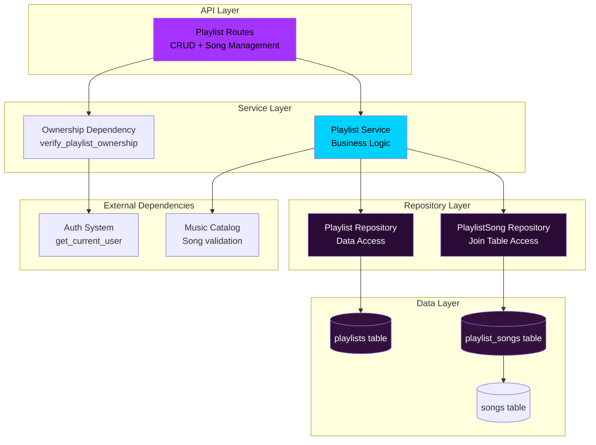
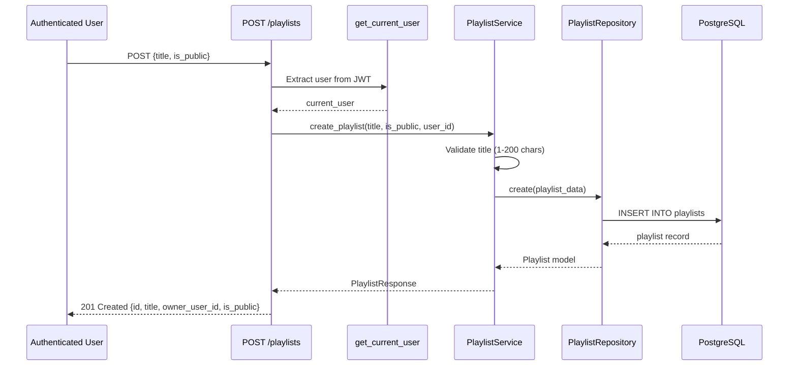
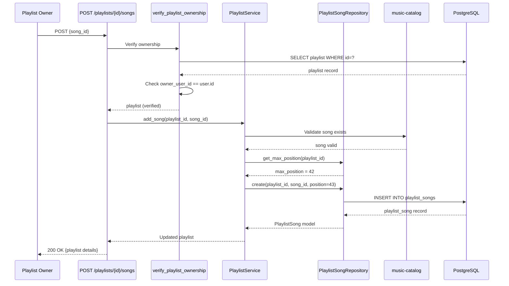
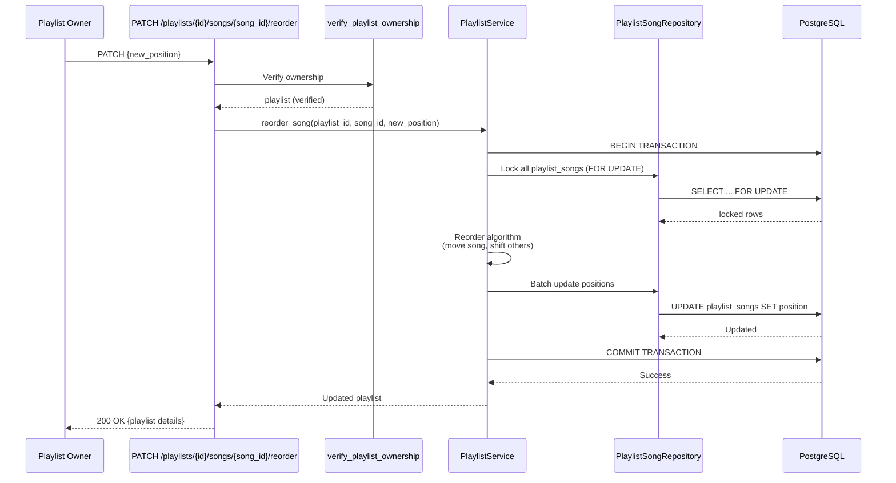

# Technical Design Document

## Overview

**Purpose**: This feature delivers playlist creation and management capabilities for authenticated users of The Sonic Immersive platform. Users can create personalized music collections, organize songs with position ordering, control privacy settings (public/private), and share playlists with others.

**Users**: Authenticated users building personal music collections will utilize this system for playlist CRUD operations, song management (add/remove/reorder), and privacy control. Guest users can discover and view public playlists.

**Impact**: Extends existing music-catalog-management and auth-security-foundation systems with user-generated content capabilities. Introduces many-to-many relationship between users/songs via playlists with position ordering and duplicate song support.

### Goals
- Enable authenticated users to create and manage personal playlists
- Support playlist CRUD operations with ownership verification
- Provide song management within playlists (add, remove, reorder)
- Enforce privacy controls (public/private) with ownership-based access
- Support playlists with up to 1000 songs with acceptable performance

### Non-Goals
- Collaborative playlists (shared editing by multiple users)
- Playlist folders or hierarchical organization
- Auto-generated smart playlists based on preferences
- Playlist versioning or history tracking
- Social features (likes, comments, follows)

## Architecture

### Existing Architecture Analysis

This feature extends existing systems:

**music-catalog-management**:
- Uses songs, albums, artists tables for catalog data
- Implements soft delete for songs (deleted_at column)
- Provides repository pattern for data access
- Pagination with offset-based approach (page/page_size)

**auth-security-foundation**:
- JWT authentication with get_current_user dependency
- Role-based access control (guest, user, artist, admin)
- Ownership verification pattern for protected resources

**Integration Points**:
- Playlists reference songs.id via playlist_songs join table
- Ownership verification uses auth get_current_user dependency
- Soft-deleted songs excluded from playlist queries (JOIN with deleted_at IS NULL)
- Repository pattern consistent with music-catalog-management

### Architecture Pattern & Boundary Map

**Selected Pattern**: Clean Architecture with Repository Pattern



**Architecture Integration**:
- **Pattern**: Clean Architecture (Routes → Services → Repositories → Models) consistent with music-catalog-management
- **Domain Boundaries**:
  - **Playlist Aggregate**: playlist entity owns playlist_songs collection (aggregate root)
  - **Ownership Boundary**: verify_playlist_ownership dependency enforces owner-only mutations
  - **Catalog Integration**: Validates song_id exists before adding to playlist (external boundary)
- **Existing Patterns Preserved**: Repository pattern, async/await SQLAlchemy, FastAPI dependency injection
- **New Components Rationale**:
  - PlaylistService: Business logic for CRUD, song management, position reordering
  - PlaylistRepository: Data access for playlists table
  - PlaylistSongRepository: Data access for playlist_songs join table (position management)
  - verify_playlist_ownership: Reusable dependency for mutation endpoints
- **Steering Compliance**: TDD mandatory, Clean Architecture separation, async SQLAlchemy patterns

### Technology Stack

| Layer | Choice / Version | Role in Feature | Notes |
|-------|------------------|-----------------|-------|
| Backend / Services | FastAPI + Python 3.10+ | API routes, dependency injection for ownership verification | Async/await pattern for database operations |
| Backend / Services | SQLAlchemy 2.0 async ORM | Playlist and playlist_songs model definitions, relationships | AsyncSession for transactions, selectinload for eager loading |
| Data / Storage | PostgreSQL (Neon) | Relational storage for playlists, playlist_songs join table | Foreign keys with CASCADE/RESTRICT, position ordering |
| Backend / Services | Pydantic 2.x | Request/response schemas with validation | Validate title length (1-200 chars), privacy boolean |
| Backend / Services | pytest + pytest-asyncio | TDD test framework for unit/integration tests | Mock repository for unit tests, real DB for integration |

**Rationale**:
- **FastAPI**: Dependency injection pattern ideal for ownership verification, async routes match SQLAlchemy async
- **SQLAlchemy 2.0 async**: Consistent with music-catalog-management, supports transactions with row-level locking for reordering
- **PostgreSQL**: Foreign key CASCADE/RESTRICT for referential integrity, efficient indexing on (playlist_id, position)
- **Pydantic**: Automatic validation for playlist title, privacy settings, pagination parameters

## System Flows

### Create Playlist Flow


**Key Decisions**:
- get_current_user dependency extracts user_id from JWT
- Pydantic validation enforces title length (1-200 characters)
- Default is_public=false (private) if not specified
- created_at and updated_at timestamps set automatically

### Add Song to Playlist Flow


**Key Decisions**:
- verify_playlist_ownership dependency checks ownership before proceeding
- Validate song_id exists in catalog (prevents broken references)
- Position set to max(position) + 1 (append to end)
- Duplicates allowed (surrogate key enables multiple instances)

### Reorder Song in Playlist Flow


**Key Decisions**:
- Row-level locking (SELECT FOR UPDATE) prevents race conditions
- Transaction ensures atomic position updates (all or nothing)
- Reorder algorithm: move target song, shift others up/down to fill gaps
- Renumber positions to sequential (1, 2, 3, ..., N) after reorder

## Requirements Traceability

| Requirement | Summary | Components | Interfaces | Flows |
|-------------|---------|------------|------------|-------|
| 1 | Playlist Creation | PlaylistService, PlaylistRepository | PlaylistCreate, PlaylistResponse | Create Playlist |
| 2 | Playlist Retrieval | PlaylistService, PlaylistRepository | PlaylistResponse | - |
| 3 | Playlist Update | PlaylistService, PlaylistRepository, verify_playlist_ownership | PlaylistUpdate | - |
| 4 | Playlist Deletion | PlaylistService, PlaylistRepository, verify_playlist_ownership | - | - |
| 5 | Add Song to Playlist | PlaylistService, PlaylistSongRepository, verify_playlist_ownership | AddSongRequest | Add Song |
| 6 | Remove Song from Playlist | PlaylistService, PlaylistSongRepository, verify_playlist_ownership | - | - |
| 7 | Reorder Songs | PlaylistService, PlaylistSongRepository, verify_playlist_ownership | ReorderRequest | Reorder Song |
| 8 | Privacy Control | PlaylistService, verify_playlist_ownership | PlaylistUpdate | - |
| 9 | Playlist Song Limit | PlaylistService, PlaylistRepository | - | - |
| 10 | Ownership Verification | verify_playlist_ownership | - | All mutation flows |
| 11 | Playlist Song Details | PlaylistService, PlaylistSongRepository | PlaylistSongResponse | - |
| 12 | Duplicate Song Handling | PlaylistSongRepository | - | Add Song |

## Components and Interfaces

### Component Summary

| Component | Domain/Layer | Intent | Req Coverage | Key Dependencies (P0/P1) | Contracts |
|-----------|--------------|--------|--------------|--------------------------|-----------|
| PlaylistService | Service | Business logic for playlist CRUD, song management, position reordering | 1, 2, 3, 4, 5, 6, 7, 9, 11 | PlaylistRepository (P0), PlaylistSongRepository (P0), music-catalog (P1) | Service Interface |
| PlaylistRepository | Repository | Data access for playlists table | 1, 2, 3, 4 | AsyncSession (P0) | Repository Interface |
| PlaylistSongRepository | Repository | Data access for playlist_songs join table with position management | 5, 6, 7, 11, 12 | AsyncSession (P0) | Repository Interface |
| verify_playlist_ownership | Middleware | FastAPI dependency verifying user owns playlist | 3, 4, 5, 6, 7, 8, 10 | get_current_user (P0), PlaylistRepository (P0) | Dependency Function |
| Playlist (Model) | Data | SQLAlchemy model for playlists table | 1, 2, 3, 4 | None (P0) | Data Model |
| PlaylistSong (Model) | Data | SQLAlchemy model for playlist_songs join table | 5, 6, 7, 11, 12 | None (P0) | Data Model |

---

### Service Layer

#### PlaylistService

| Field | Detail |
|-------|--------|
| Intent | Orchestrates playlist CRUD operations, song management within playlists, position reordering, and privacy control |
| Requirements | 1, 2, 3, 4, 5, 6, 7, 9, 11 |
| Owner / Reviewers | Backend Team |

**Responsibilities & Constraints**
- Create playlist with title validation (1-200 characters) and default privacy (private)
- Retrieve playlists with ownership filtering (only owner or public playlists)
- Update playlist title and privacy settings with ownership verification
- Delete playlist (hard delete with CASCADE for playlist_songs)
- Add song to playlist with catalog validation and position assignment (max + 1)
- Remove song from playlist by playlist_song_id (specific instance, not all)
- Reorder songs with transaction and row-level locking for consistency
- Calculate total_duration_seconds and songs_count from join query
- Enforce playlist song limit (log warning at 1000 songs)

**Dependencies**
- Outbound: PlaylistRepository for playlist CRUD (P0)
- Outbound: PlaylistSongRepository for song management (P0)
- Outbound: music-catalog SongRepository for song validation (P1)
- External: AsyncSession for database transactions (P0)

**Contracts**: Service Interface [X]

##### Service Interface
```python
class PlaylistService:
    def __init__(
        self,
        playlist_repo: PlaylistRepository,
        playlist_song_repo: PlaylistSongRepository,
        song_repo: SongRepository,
    ):
        self.playlist_repo = playlist_repo
        self.playlist_song_repo = playlist_song_repo
        self.song_repo = song_repo
    
    async def create_playlist(
        self, title: str, is_public: bool, owner_user_id: int
    ) -> Playlist:
        """Create new playlist with validation."""
        # Validate title (1-200 chars)
        # Create playlist record with owner_user_id
        # Return created playlist
        pass
    
    async def get_playlist_by_id(
        self, playlist_id: int, current_user_id: Optional[int] = None
    ) -> Optional[Playlist]:
        """Retrieve playlist with songs. Enforce privacy (private → owner only)."""
        # Fetch playlist with songs (eager loading)
        # If private, verify current_user_id == owner_user_id
        # Calculate total_duration_seconds, songs_count
        # Return playlist or raise 403
        pass
    
    async def get_user_playlists(
        self, user_id: int, page: int = 1, page_size: int = 20
    ) -> tuple[list[Playlist], int]:
        """Retrieve user's playlists with pagination."""
        # Query playlists WHERE owner_user_id = user_id
        # Paginate results (LIMIT/OFFSET)
        # Return playlists and total count
        pass
    
    async def get_public_playlists(
        self, page: int = 1, page_size: int = 20
    ) -> tuple[list[Playlist], int]:
        """Retrieve public playlists with pagination."""
        # Query playlists WHERE is_public = true
        # Paginate results
        # Return playlists and total count
        pass
    
    async def update_playlist(
        self, playlist_id: int, title: Optional[str], is_public: Optional[bool]
    ) -> Playlist:
        """Update playlist title or privacy. Ownership verified by dependency."""
        # Update title (validate if provided)
        # Update is_public (if provided)
        # Update updated_at timestamp
        # Return updated playlist
        pass
    
    async def delete_playlist(self, playlist_id: int) -> None:
        """Delete playlist. Ownership verified by dependency. CASCADE deletes songs."""
        # Delete playlist record
        # playlist_songs deleted automatically via CASCADE
        pass
    
    async def add_song_to_playlist(
        self, playlist_id: int, song_id: int
    ) -> Playlist:
        """Add song to playlist with position assignment. Ownership verified by dependency."""
        # Validate song exists in catalog
        # Get max position for playlist
        # Create playlist_song with position = max + 1
        # Return updated playlist
        pass
    
    async def remove_song_from_playlist(
        self, playlist_id: int, playlist_song_id: int
    ) -> Playlist:
        """Remove specific song instance from playlist. Ownership verified by dependency."""
        # Delete playlist_song by id
        # Reorder remaining positions (fill gaps)
        # Return updated playlist
        pass
    
    async def reorder_song(
        self, playlist_id: int, playlist_song_id: int, new_position: int
    ) -> Playlist:
        """Reorder song within playlist. Ownership verified by dependency."""
        # BEGIN TRANSACTION
        # Lock all playlist_songs for playlist (SELECT FOR UPDATE)
        # Move target song to new position
        # Shift other songs up/down to fill gap
        # Renumber positions to sequential (1, 2, 3, ...)
        # COMMIT TRANSACTION
        # Return updated playlist
        pass
```

**Implementation Notes**
- Integration: Reuses music-catalog SongRepository for validation, auth get_current_user for user context
- Validation: Title length (1-200), song existence, position bounds (1 to songs_count)
- Risks: Reorder transaction may take 200-300ms for 1000-song playlists (acceptable per requirement)

---

### Repository Layer

#### PlaylistRepository

| Field | Detail |
|-------|--------|
| Intent | Data access layer for playlists table with CRUD operations and pagination |
| Requirements | 1, 2, 3, 4 |

**Responsibilities & Constraints**
- Create playlist record with title, owner_user_id, is_public, timestamps
- Retrieve playlist by ID with eager loading of songs
- Update playlist title and/or is_public field
- Delete playlist record (CASCADE deletes playlist_songs)
- Query playlists by owner_user_id with pagination
- Query public playlists (is_public=true) with pagination
- Calculate songs_count and total_duration_seconds via aggregate query

**Dependencies**
- External: AsyncSession for database operations (P0)

**Contracts**: Repository Interface [X]

##### Repository Interface
```python
class PlaylistRepository:
    def __init__(self, db: AsyncSession):
        self.db = db
    
    async def create(self, title: str, owner_user_id: int, is_public: bool = False) -> Playlist:
        """Create new playlist record."""
        playlist = Playlist(
            title=title,
            owner_user_id=owner_user_id,
            is_public=is_public,
            created_at=datetime.now(),
            updated_at=datetime.now(),
        )
        self.db.add(playlist)
        await self.db.commit()
        await self.db.refresh(playlist)
        return playlist
    
    async def get_by_id(self, playlist_id: int, include_songs: bool = True) -> Optional[Playlist]:
        """Retrieve playlist by ID with optional song eager loading."""
        query = select(Playlist).where(Playlist.id == playlist_id)
        if include_songs:
            query = query.options(selectinload(Playlist.songs))
        result = await self.db.execute(query)
        return result.scalar_one_or_none()
    
    async def get_by_owner(
        self, owner_user_id: int, page: int, page_size: int
    ) -> tuple[list[Playlist], int]:
        """Retrieve playlists owned by user with pagination."""
        query = select(Playlist).where(Playlist.owner_user_id == owner_user_id)
        total = await self.db.execute(select(func.count()).select_from(query.subquery()))
        total_count = total.scalar()
        
        paginated = query.limit(page_size).offset((page - 1) * page_size)
        result = await self.db.execute(paginated)
        playlists = result.scalars().all()
        return playlists, total_count
    
    async def get_public(self, page: int, page_size: int) -> tuple[list[Playlist], int]:
        """Retrieve public playlists with pagination."""
        query = select(Playlist).where(Playlist.is_public == True)
        total = await self.db.execute(select(func.count()).select_from(query.subquery()))
        total_count = total.scalar()
        
        paginated = query.limit(page_size).offset((page - 1) * page_size)
        result = await self.db.execute(paginated)
        playlists = result.scalars().all()
        return playlists, total_count
    
    async def update(
        self, playlist_id: int, title: Optional[str] = None, is_public: Optional[bool] = None
    ) -> Optional[Playlist]:
        """Update playlist title and/or privacy."""
        playlist = await self.get_by_id(playlist_id, include_songs=False)
        if not playlist:
            return None
        if title is not None:
            playlist.title = title
        if is_public is not None:
            playlist.is_public = is_public
        playlist.updated_at = datetime.now()
        await self.db.commit()
        await self.db.refresh(playlist)
        return playlist
    
    async def delete(self, playlist_id: int) -> bool:
        """Delete playlist. CASCADE deletes playlist_songs."""
        playlist = await self.get_by_id(playlist_id, include_songs=False)
        if not playlist:
            return False
        await self.db.delete(playlist)
        await self.db.commit()
        return True
```

**Implementation Notes**
- Integration: Consistent with music-catalog-management repository pattern
- Validation: None (delegated to service layer)
- Risks: get_by_id with songs eager loading may be slow for 1000-song playlists (use pagination)

---

#### PlaylistSongRepository

| Field | Detail |
|-------|--------|
| Intent | Data access layer for playlist_songs join table with position management and reordering logic |
| Requirements | 5, 6, 7, 11, 12 |

**Responsibilities & Constraints**
- Add song to playlist with position assignment (max + 1)
- Remove song from playlist by playlist_song_id (specific instance)
- Reorder songs with transaction and row-level locking
- Retrieve playlist songs with pagination, ordered by position
- Filter out soft-deleted songs (JOIN with songs.deleted_at IS NULL)
- Calculate max position for playlist
- Support duplicate song instances (surrogate key)

**Dependencies**
- External: AsyncSession for database operations (P0)

**Contracts**: Repository Interface [X]

##### Repository Interface
```python
class PlaylistSongRepository:
    def __init__(self, db: AsyncSession):
        self.db = db
    
    async def add_song(self, playlist_id: int, song_id: int) -> PlaylistSong:
        """Add song to playlist with next available position."""
        max_pos = await self.get_max_position(playlist_id)
        next_position = (max_pos or 0) + 1
        
        playlist_song = PlaylistSong(
            playlist_id=playlist_id,
            song_id=song_id,
            position=next_position,
            created_at=datetime.now(),
        )
        self.db.add(playlist_song)
        await self.db.commit()
        await self.db.refresh(playlist_song)
        return playlist_song
    
    async def remove_song(self, playlist_song_id: int) -> bool:
        """Remove specific song instance from playlist."""
        playlist_song = await self.db.get(PlaylistSong, playlist_song_id)
        if not playlist_song:
            return False
        
        playlist_id = playlist_song.playlist_id
        await self.db.delete(playlist_song)
        await self.db.commit()
        
        # Reorder remaining songs to fill gaps
        await self._reorder_positions(playlist_id)
        return True
    
    async def get_songs(
        self, playlist_id: int, page: int = 1, page_size: int = 50
    ) -> tuple[list[dict], int]:
        """Retrieve playlist songs with full details (song, album, artist). Paginated."""
        query = (
            select(
                PlaylistSong.id.label('playlist_song_id'),
                PlaylistSong.position,
                Song.id.label('song_id'),
                Song.title.label('song_title'),
                Song.duration_seconds,
                Album.title.label('album_title'),
                Artist.name.label('artist_name'),
            )
            .join(Song, PlaylistSong.song_id == Song.id)
            .join(Album, Song.album_id == Album.id)
            .join(Artist, Album.artist_id == Artist.id)
            .where(PlaylistSong.playlist_id == playlist_id)
            .where(Song.deleted_at.is_(None))  # Exclude soft-deleted songs
            .order_by(PlaylistSong.position.asc())
        )
        
        total = await self.db.execute(select(func.count()).select_from(query.subquery()))
        total_count = total.scalar()
        
        paginated = query.limit(page_size).offset((page - 1) * page_size)
        result = await self.db.execute(paginated)
        songs = [dict(row) for row in result.mappings().all()]
        return songs, total_count
    
    async def reorder_song(
        self, playlist_id: int, playlist_song_id: int, new_position: int
    ) -> None:
        """Reorder song within playlist with transaction and locking."""
        async with self.db.begin():
            # Lock all playlist_songs for this playlist
            songs = await self.db.execute(
                select(PlaylistSong)
                .where(PlaylistSong.playlist_id == playlist_id)
                .order_by(PlaylistSong.position)
                .with_for_update()
            )
            songs_list = list(songs.scalars().all())
            
            # Find target song
            target_song = next((s for s in songs_list if s.id == playlist_song_id), None)
            if not target_song:
                raise ValueError(f"PlaylistSong {playlist_song_id} not found")
            
            # Reorder algorithm
            old_position = target_song.position
            if old_position == new_position:
                return  # No change needed
            
            # Remove target from list
            songs_list.remove(target_song)
            
            # Insert at new position
            songs_list.insert(new_position - 1, target_song)
            
            # Renumber all positions sequentially
            for idx, song in enumerate(songs_list, start=1):
                song.position = idx
            
            await self.db.commit()
    
    async def get_max_position(self, playlist_id: int) -> Optional[int]:
        """Get maximum position for playlist."""
        result = await self.db.execute(
            select(func.max(PlaylistSong.position))
            .where(PlaylistSong.playlist_id == playlist_id)
        )
        return result.scalar()
    
    async def _reorder_positions(self, playlist_id: int) -> None:
        """Internal: Renumber positions to fill gaps after removal."""
        songs = await self.db.execute(
            select(PlaylistSong)
            .where(PlaylistSong.playlist_id == playlist_id)
            .order_by(PlaylistSong.position)
        )
        songs_list = list(songs.scalars().all())
        
        for idx, song in enumerate(songs_list, start=1):
            song.position = idx
        await self.db.commit()
```

**Implementation Notes**
- Integration: Joins with Song, Album, Artist tables for full details (matches music-catalog pattern)
- Validation: Row-level locking prevents concurrent reorder conflicts
- Risks: Reorder transaction may deadlock if multiple requests (rare, add retry logic)

---

### Middleware Layer

#### verify_playlist_ownership

| Field | Detail |
|-------|--------|
| Intent | FastAPI dependency verifying authenticated user owns playlist before allowing mutations |
| Requirements | 3, 4, 5, 6, 7, 8, 10 |

**Responsibilities & Constraints**
- Extract current_user from JWT via get_current_user dependency
- Fetch playlist by ID from database
- Compare playlist.owner_user_id with current_user.id
- Raise HTTPException(403) if ownership verification fails
- Raise HTTPException(404) if playlist does not exist
- Return verified playlist to route handler (avoids duplicate query)

**Dependencies**
- Inbound: All mutation route handlers (P0)
- Outbound: get_current_user from auth-security-foundation (P0)
- Outbound: PlaylistRepository for playlist lookup (P0)

**Contracts**: Dependency Function [X]

##### Dependency Function
```python
async def verify_playlist_ownership(
    playlist_id: int,
    current_user: User = Depends(get_current_user),
    db: AsyncSession = Depends(get_db),
) -> Playlist:
    """Verify current user owns playlist. Raises 403 if not owner, 404 if not found."""
    playlist_repo = PlaylistRepository(db)
    playlist = await playlist_repo.get_by_id(playlist_id, include_songs=False)
    
    if not playlist:
        raise HTTPException(status_code=404, detail="Playlist not found")
    
    if playlist.owner_user_id != current_user.id:
        raise HTTPException(
            status_code=403,
            detail="You do not own this playlist"
        )
    
    return playlist
```

**Implementation Notes**
- Integration: Composes with get_current_user via FastAPI Depends
- Validation: Ensures owner_user_id == current_user.id before proceeding
- Risks: Extra database query adds latency (50-100ms), consider caching for optimization

---

## Data Models

### Domain Model

**Playlist Aggregate**:
- **Aggregate Root**: Playlist entity
- **Entities**: PlaylistSong (child entities in collection)
- **Value Objects**: Title (string), Privacy (boolean)
- **Invariants**:
  - Title must be 1-200 characters
  - owner_user_id must reference valid user
  - Positions within playlist must be sequential (1, 2, 3, ...)
  - Maximum 1000 songs per playlist (soft limit, warning only)

**Relationships**:
- Playlist → PlaylistSong (one-to-many, aggregate boundary)
- PlaylistSong → Song (many-to-one, external reference to catalog)
- Playlist → User (many-to-one, ownership)

### Logical Data Model

**Structure Definition**:
- **Playlists Entity**:
  - Attributes: id (PK), title, owner_user_id (FK), is_public, created_at, updated_at
  - Cardinality: User (1) → Playlists (*)
- **PlaylistSongs Entity** (Association table):
  - Attributes: id (PK), playlist_id (FK), song_id (FK), position, created_at
  - Cardinality: Playlist (1) → PlaylistSongs (*), Song (1) → PlaylistSongs (*)
  - Surrogate key (id) enables duplicate song instances
- **Natural Keys**:
  - Playlist: id (surrogate primary key, auto-increment)
  - PlaylistSong: id (surrogate primary key, allows duplicates)
- **Referential Integrity**:
  - playlist_songs.playlist_id → playlists.id (ON DELETE CASCADE)
  - playlist_songs.song_id → songs.id (ON DELETE RESTRICT)
  - playlists.owner_user_id → users.id (ON DELETE CASCADE)

**Consistency & Integrity**:
- **Transaction Boundaries**: Playlist + PlaylistSongs aggregate (atomic updates)
- **Cascading Rules**: Delete playlist → cascade delete playlist_songs
- **Temporal Aspects**: created_at (immutable), updated_at (modified on updates)

### Physical Data Model

**For PostgreSQL (Neon)**:

```sql
-- Playlists table (already exists in digital-music-store.sql, extend with columns)
CREATE TABLE playlists (
  id SERIAL PRIMARY KEY,
  title VARCHAR(200) NOT NULL,
  owner_user_id INTEGER NOT NULL REFERENCES users(id) ON DELETE CASCADE,
  is_public BOOLEAN NOT NULL DEFAULT FALSE,
  created_at TIMESTAMPTZ DEFAULT NOW(),
  updated_at TIMESTAMPTZ DEFAULT NOW()
);

-- Indexes for playlists
CREATE INDEX idx_playlists_owner ON playlists(owner_user_id);
CREATE INDEX idx_playlists_public ON playlists(is_public) WHERE is_public = TRUE;

-- PlaylistSongs join table (many-to-many with position)
CREATE TABLE playlist_songs (
  id SERIAL PRIMARY KEY,
  playlist_id INTEGER NOT NULL REFERENCES playlists(id) ON DELETE CASCADE,
  song_id INTEGER NOT NULL REFERENCES songs(id) ON DELETE RESTRICT,
  position INTEGER NOT NULL,
  created_at TIMESTAMPTZ DEFAULT NOW()
);

-- Indexes for playlist_songs
CREATE INDEX idx_playlist_songs_playlist_position ON playlist_songs(playlist_id, position);
CREATE INDEX idx_playlist_songs_song ON playlist_songs(song_id);

-- Note: No unique constraint on (playlist_id, song_id) to allow duplicates
```

**SQLAlchemy Models**:

```python
from sqlalchemy import Column, Integer, String, Boolean, ForeignKey, TIMESTAMP
from sqlalchemy.orm import relationship
from datetime import datetime

class Playlist(Base):
    __tablename__ = "playlists"
    
    id = Column(Integer, primary_key=True, autoincrement=True)
    title = Column(String(200), nullable=False)
    owner_user_id = Column(Integer, ForeignKey("users.id", ondelete="CASCADE"), nullable=False)
    is_public = Column(Boolean, nullable=False, default=False)
    created_at = Column(TIMESTAMP(timezone=True), default=datetime.now)
    updated_at = Column(TIMESTAMP(timezone=True), default=datetime.now, onupdate=datetime.now)
    
    # Relationships
    owner = relationship("User", back_populates="playlists")
    playlist_songs = relationship("PlaylistSong", back_populates="playlist", cascade="all, delete-orphan", lazy="selectin")

class PlaylistSong(Base):
    __tablename__ = "playlist_songs"
    
    id = Column(Integer, primary_key=True, autoincrement=True)
    playlist_id = Column(Integer, ForeignKey("playlists.id", ondelete="CASCADE"), nullable=False)
    song_id = Column(Integer, ForeignKey("songs.id", ondelete="RESTRICT"), nullable=False)
    position = Column(Integer, nullable=False)
    created_at = Column(TIMESTAMP(timezone=True), default=datetime.now)
    
    # Relationships
    playlist = relationship("Playlist", back_populates="playlist_songs")
    song = relationship("Song")
```

**Index Strategy**:
- `idx_playlists_owner`: Optimize queries for user's playlists
- `idx_playlists_public`: Optimize queries for public playlists (partial index)
- `idx_playlist_songs_playlist_position`: Optimize position-based queries and reordering
- `idx_playlist_songs_song`: Optimize reverse lookups (which playlists contain song)

### Data Contracts & Integration

**API Data Transfer**:

```typescript
// Request Schemas
interface PlaylistCreateRequest {
  title: string;  // 1-200 characters
  is_public?: boolean;  // Default false
}

interface PlaylistUpdateRequest {
  title?: string;  // 1-200 characters
  is_public?: boolean;
}

interface AddSongRequest {
  song_id: number;
}

interface ReorderSongRequest {
  new_position: number;  // 1 to songs_count
}

// Response Schemas
interface PlaylistResponse {
  id: number;
  title: string;
  owner_user_id: number;
  is_public: boolean;
  songs_count: number;
  total_duration_seconds: number;
  created_at: string;  // ISO 8601
  updated_at: string;  // ISO 8601
  songs?: PlaylistSongResponse[];  // Paginated
  page?: number;
  page_size?: number;
  total_pages?: number;
}

interface PlaylistSongResponse {
  playlist_song_id: number;  // For removal
  position: number;
  song_id: number;
  song_title: string;
  artist_name: string;
  album_title: string;
  duration_seconds: number;
}
```

**Cross-Service Data Management**:
- **music-catalog integration**: Validate song_id exists before adding to playlist
- **auth-security integration**: Extract user_id from JWT for ownership verification
- **Eventual consistency**: Soft-deleted songs remain in playlist_songs but excluded from queries

## Error Handling

### Error Strategy

All errors follow FastAPI HTTPException pattern with appropriate status codes and descriptive messages.

### Error Categories and Responses

**User Errors (4xx)**:
- **400 Bad Request**: Invalid title (empty or >200 chars), invalid position (out of bounds), invalid page/page_size
- **401 Unauthorized**: Missing or invalid JWT token (handled by get_current_user)
- **403 Forbidden**: User not playlist owner for mutation operations, accessing private playlist not owned
- **404 Not Found**: Playlist ID not found, song ID not found in catalog, playlist_song_id not found

**System Errors (5xx)**:
- **500 Internal Server Error**: Database connection failure, unexpected exceptions

**Business Logic Errors (422)**:
- **422 Unprocessable Entity**: Song already soft-deleted (cannot add to playlist), playlist exceeds 1000 songs (warning, still allows)

### Monitoring

- Log all 403 errors (potential security issue if frequent)
- Log all 500 errors with stack trace (investigate database issues)
- Monitor reorder transaction latency (alert if p95 >300ms)
- Monitor playlist query latency for 1000-song playlists (alert if p95 >500ms)

## Testing Strategy

### Unit Tests
- **PlaylistService.create_playlist**:
  - Creates playlist with valid title (1-200 chars)
  - Sets default is_public=false if not provided
  - Sets owner_user_id from authenticated user
  - Returns 400 if title empty or >200 chars
  
- **PlaylistService.add_song_to_playlist**:
  - Validates song exists in catalog before adding
  - Assigns position = max(position) + 1
  - Allows duplicate songs (same song_id multiple times)
  - Returns 400 if song_id not found
  
- **PlaylistService.reorder_song**:
  - Moves song to new position
  - Shifts other songs up/down to fill gaps
  - Renumbers positions to sequential (1, 2, 3, ...)
  - Returns 400 if new_position out of bounds
  
- **verify_playlist_ownership**:
  - Returns playlist if owner_user_id == current_user.id
  - Raises 403 if owner_user_id != current_user.id
  - Raises 404 if playlist_id not found

### Integration Tests
- **POST /playlists**:
  - Creates playlist with authenticated user as owner
  - Returns 201 with playlist details
  - Returns 401 if not authenticated
  
- **GET /playlists/{id}**:
  - Returns playlist with songs (paginated)
  - Returns 403 if private playlist not owned by user
  - Returns public playlist to any user (including guests)
  - Excludes soft-deleted songs from results
  
- **POST /playlists/{id}/songs**:
  - Adds song to playlist (appends to end)
  - Returns 403 if user not playlist owner
  - Allows duplicate songs
  
- **DELETE /playlists/{id}/songs/{playlist_song_id}**:
  - Removes specific song instance
  - Reorders remaining positions (fills gaps)
  - Returns 404 if playlist_song_id not found
  
- **PATCH /playlists/{id}/songs/{playlist_song_id}/reorder**:
  - Reorders song to new position
  - Other songs shifted appropriately
  - Returns 400 if new_position invalid

### E2E/UI Tests
- **Playlist Management Flow**:
  - User creates playlist → adds songs → reorders songs → deletes playlist
  - Verify positions sequential after each operation
  
- **Privacy Control Flow**:
  - Owner creates private playlist → toggle to public → guest views playlist
  - Owner creates public playlist → guest searches and finds it
  
- **Duplicate Song Handling**:
  - User adds same song 3 times → playlist shows 3 instances
  - User removes 1 instance → playlist shows 2 remaining instances
  
- **Soft-Deleted Song Handling**:
  - Admin soft-deletes song → song disappears from all playlists
  - positions reordered to fill gap

### Performance/Load Tests
- **Playlist with 1000 songs**:
  - Retrieve playlist with pagination (50 songs/page) → <500ms
  - Reorder song in 1000-song playlist → <300ms
  
- **Concurrent reorder requests**:
  - 10 concurrent reorder requests to same playlist → no deadlocks, sequential processing
  
- **Pagination performance**:
  - Retrieve page 1 of 1000 songs → <200ms
  - Retrieve page 20 of 1000 songs → <300ms

## Security Considerations

**Ownership Verification**:
- All mutation operations (update, delete, add_song, remove_song, reorder) verify ownership via FastAPI dependency
- verify_playlist_ownership extracts user_id from JWT and compares with playlist.owner_user_id
- 403 Forbidden returned if ownership verification fails

**Privacy Enforcement**:
- Private playlists (is_public=false) only accessible to owner
- Public playlists (is_public=true) accessible to all users (including guests)
- Ownership check performed before returning private playlist details

**SQL Injection Prevention**:
- SQLAlchemy ORM uses parameterized queries (no manual SQL construction)
- Pydantic validation sanitizes input (title length, position bounds)

**Authorization**:
- Read operations: Public playlists accessible to all, private playlists owner-only
- Mutation operations: Owner-only (enforced by verify_playlist_ownership dependency)

## Performance & Scalability

**Target Metrics**:
- **Playlist CRUD**: <300ms for 95% of requests (Requirement Non-Functional Performance 1)
- **Add/Remove Song**: <200ms for 95% of requests (Requirement Non-Functional Performance 2)
- **Retrieve 1000-song playlist**: <500ms (Requirement Non-Functional Performance 3)

**Optimization Strategies**:
- **Pagination**: Default 50 songs/page (max 100) reduces data transfer for large playlists
- **Eager Loading**: selectinload for playlist_songs relationship prevents N+1 queries
- **Indexes**: (playlist_id, position) index optimizes position-based queries and reordering
- **Row-level locking**: Serializes concurrent reorder requests (prevents race conditions, acceptable performance trade-off)

**Scalability**:
- **Per-user limit**: 100 playlists per user (Requirement Non-Functional Scalability 1)
- **Per-playlist limit**: 1000 songs per playlist (Requirement Non-Functional Scalability 2)
- **Pagination**: Offset-based sufficient for MVP (cursor-based migration if performance degrades)

## Supporting References

### Reorder Algorithm Pseudocode

```python
def reorder_song(playlist_id, playlist_song_id, new_position):
    """
    Reorder song within playlist with gap-free sequential positions.
    
    Example:
    Initial: [song1:1, song2:2, song3:3, song4:4, song5:5]
    Reorder song3 (position 3) to position 1:
    Result: [song3:1, song1:2, song2:3, song4:4, song5:5]
    """
    # Lock all playlist_songs for this playlist
    songs = SELECT * FROM playlist_songs 
            WHERE playlist_id = ? 
            ORDER BY position 
            FOR UPDATE
    
    # Find target song
    target = find(songs, id=playlist_song_id)
    old_position = target.position
    
    if old_position == new_position:
        return  # No change needed
    
    # Remove target from list
    songs.remove(target)
    
    # Insert at new position (0-indexed: new_position - 1)
    songs.insert(new_position - 1, target)
    
    # Renumber all positions sequentially
    for idx, song in enumerate(songs, start=1):
        song.position = idx
    
    COMMIT TRANSACTION
```

### Playlist Song Limit Warning Logic

```python
async def add_song_to_playlist(playlist_id: int, song_id: int):
    """Add song with 1000-song warning."""
    songs_count = await playlist_song_repo.count(playlist_id)
    
    if songs_count >= 1000:
        logger.warning(
            f"Playlist {playlist_id} exceeds 1000 songs ({songs_count}). "
            "Performance may degrade."
        )
        # Still allow creation (Requirement 9.2)
    
    # Proceed with adding song
    await playlist_song_repo.add_song(playlist_id, song_id)
```

### Soft-Deleted Song Filter Query

```sql
-- Retrieve playlist songs excluding soft-deleted
SELECT 
  ps.id AS playlist_song_id,
  ps.position,
  s.id AS song_id,
  s.title AS song_title,
  s.duration_seconds,
  a.title AS album_title,
  ar.name AS artist_name
FROM playlist_songs ps
JOIN songs s ON ps.song_id = s.id
JOIN albums a ON s.album_id = a.id
JOIN artists ar ON a.artist_id = ar.id
WHERE ps.playlist_id = ?
  AND s.deleted_at IS NULL  -- Exclude soft-deleted songs
ORDER BY ps.position ASC
LIMIT ? OFFSET ?;
```
